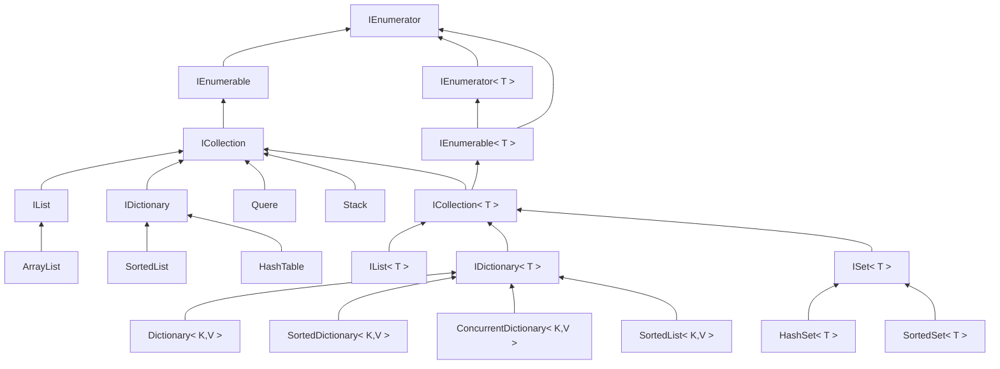

# 集合

在 C# 中，有多種內建的集合類型，這些集合類型都位於 System.Collections 和 System.Collections.Generic 命名空間下。

1. 非泛型集合（System.Collections 命名空間）
   1. ArrayList： 一個可動態調整大小的陣列。
   2. Hashtable： 用於儲存鍵/值對的集合，類似於字典。
   3. SortedList： 有序的鍵/值對集合。
   4. Queue： 先進先出（FIFO）的佇列。
   5. Stack： 後進先出（LIFO）的堆疊。

2. 泛型集合（System.Collections.Generic 命名空間）
   1. List<T>： 動態陣列，支援泛型。
   2. Dictionary<K, V>： 鍵/值對的泛型集合，類似於 Hashtable。
   3. HashSet<T>： 唯一值的泛型無序集合。
   4. Queue<T>： 先進先出（FIFO）的泛型佇列。
   5. Stack<T>： 後進先出（LIFO）的泛型堆疊。
   6. LinkedList<T>： 雙向連結串列。
   7. SortedDictionary<K, V>： 有序的鍵/值對泛型字典。
   8. SortedList<K, V>： 有序的鍵/值對泛型集合。

3. 非泛型和泛型集合的共通點
   1. IEnumerable 和 IEnumerator 介面：  
      這兩個介面支援集合元素的迭代。
   2. ICollection 和 ICollection<T> 介面：  
      提供集合的大小、物件添加到集合、清除元素的方法。
   3. IList 和 IList<T> 介面：
      提供對集合中元素的索引存取、排序。
   4. IDictionary 和 IDictionary<K, V> 介面：
      提供對鍵/值對的索引存取。

## 繼承圖



### 效能選擇

| 集合類型         | 排序           | 連續儲存 | 直接存取 | 查找效率 | 增刪效率 | 備註                                                           |
| ---------------- | -------------- | -------- | -------- | -------- | -------- | -------------------------------------------------------------- |
| Dictionary       | 未排序         | 是       | 透過鍵   | O(1)     | O(1)     | 搜尋速度最   快。                                              |
| HashSet          | 元素不可重複   | 是       | 透過鍵   | O(1)     | O(1)     | 元素不可重複，且自動排序的集合。                               |
| LinkedList       | 元素不可重複   | 否       | 透過鍵   | O(1)     | O(1)     | 元素不可重複，且未排序的集合。                                 |
| List             | 未排序         | 否       | 透過索引 | O(n)     | O(n)     | 最適合不需要直接存取、而且經常在串列中間插入與刪除元素的場合。 |
| Queue            | 先進先出       | 是       | 透過索引 | O(1)     | O(1)     | 與 List<T> 相似，主要差別在於存取的順序是先進先出。            |
| SortedDictionary | 有排序         | 是       | 透過鍵   | O(log n) | O(log n) | 搜尋速度略遜於 Dictionary，但有排序功能。                      |
| SortedList       | 有排序         | 是       | 透過索引 | O(log n) | O(n)     | 類似 SortedDictionary，但搜尋速度稍快。                        |
| SortedSet        | 排序但不可重複 | 否       | 透過鍵   | O(log n) | O(log n) | 具有排序功能的集合。                                           |
| Stack            | 後進先出       | 是       | 透過索引 | O(1)     | O(1)*    | 與 List<T> 相似，主要差別在於存取的順序是後進先出。            |

by Arthur Minduca

```C#
//List<T>:
List<int> numbersList = new List<int>() { 1, 2, 3, 4, 5 };

//Dictionary<TKey, TValue>:
Dictionary<string, int> ages = new Dictionary<string, int>();
ages.Add("John", 25);
ages.Add("Jane", 30);

//HashSet<T>:
HashSet<int> uniqueNumbers = new HashSet<int>() { 1, 2, 3, 4, 5 };

//Queue<T>:
Queue<string> queue = new Queue<string>();
queue.Enqueue("First");
queue.Enqueue("Second");

//Stack<T>:
Stack<string> stack = new Stack<string>();
stack.Push("First");
stack.Push("Second");

//LinkedList<T>:
LinkedList<int> linkedList = new LinkedList<int>();
linkedList.AddLast(1);
linkedList.AddLast(2);
linkedList.AddLast(3);

//SortedList<TKey, TValue>:
SortedList<int, string> sortedList = new SortedList<int, string>();
sortedList.Add(3, "Three");
sortedList.Add(1, "One");
sortedList.Add(2, "Two");

```