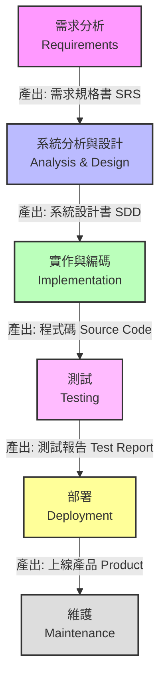

# 01. 瀑布式開發 (Waterfall Model) 詳解

瀑布式模型 (Waterfall Model) 是軟體工程中最經典、最古老的開發流程。它的核心思想是**「按部就班」**，將軟體開發過程切割成一系列線性的階段，前一個階段完成後，才能進入下一個階段，就像瀑布的水流一樣，不可逆轉。

雖然現代開發多推崇敏捷，但深入理解瀑布式開發對於掌握軟體工程基礎至關重要，且在某些特定場景下（如軍事、航太、醫療），它仍是主流。

## 1. 瀑布式開發的生命週期 (SDLC)

標準的瀑布模型通常包含以下六大階段。我們使用 Mermaid 流程圖來展示其線性結構。

### 各階段詳細解說與產出

| 階段 | 核心任務 | 關鍵產出文件 (Documents) | 學生專題對應 |
| :--- | :--- | :--- | :--- |
| **1. 需求分析** (Requirements) | 訪談客戶，釐清系統要「做什麼」(What)。界定範圍，確認所有功能細節。 | **需求規格書 (SRS)** 包含功能列表、使用案例 (Use Cases)、非功能需求 (效能、資安)。 | 確定題目，寫出完整的功能清單（例如：會員要有註冊、登入、忘記密碼）。 |
| **2. 系統設計** (Design) | 規劃系統要「如何做」(How)。設計資料庫架構、API 介面、類別圖。 | **系統設計書 (SDD)** ER Model, Class Diagram, Sequence Diagram, API 文件。 | 畫 ER 圖、繪製 Figma UI 草圖、規劃 MVC 架構。 |
| **3. 實作** (Implementation) | 根據設計書寫程式碼。此階段不應再問「要做什麼」，而是專注於將設計轉為程式碼。 | **原始碼 (Source Code)** 單元測試 (Unit Test)。 | 瘋狂寫 Code 的階段。前端切版，後端寫 C# Controller/Service。 |
| **4. 測試** (Testing) | 驗證系統是否符合 SRS 的需求。找出 Bug 並修復。 | **測試計畫、測試報告** Bug List。 | 點擊所有按鈕，測試各種極端輸入（如輸入負數金額）。 |
| **5. 部署** (Deployment) | 將軟體安裝到客戶的正式環境 (Production)。 | **安裝手冊、使用手冊** | 將網站發佈到 Azure/AWS，設定 IIS，確保網址可公開存取。 |
| **6. 維護** (Maintenance) | 軟體上線後的修補、優化或功能新增。 | **維護紀錄、更新日誌** | 修正 demo 時發現的錯誤，或因應 OS 更新進行調整。 |

---

## 2. 瀑布式的特性與知識點

### 2.1 文件導向 (Document-Driven)
*   **觀念**: 瀑布式非常依賴文件。階段之間的交接（Handover）是透過文件進行的。
*   **優點**: 若人員異動，接手的人可以看文件快速進入狀況（前提是文件有更新）。
*   **缺點**: 寫文件非常耗時，且文件往往跟不上程式碼的變更（Documentation Rot）。

### 2.2 凍結需求 (Freezing Requirements)
*   **觀念**: 在進入「設計」階段前，需求必須被「簽核 (Sign-off)」並凍結。之後若要修改需求，必須走嚴格的「變更控制流程 (Change Control Process)」。
*   **目的**: 避免開發過程中需求變來變去 (Scope Creep)，導致專案永遠做不完。

### 2.3 晚期整合 (Big Bang Integration)
*   **觀念**: 通常到開發週期的最後階段（測試階段），各個模組（前端、後端、資料庫）才會真正接在一起。
*   **風險**: 這時候才發現介面不合（Interface Mismatch）或邏輯錯誤，修正成本極高。

---

## 3. 實例演練：圖書管理系統 (Library System)

讓我們用一個具體的學生專題為例，看看瀑布式是如何運作的。

### 情境
你們小組決定做一個「系上圖書借閱系統」。學期共 16 週。

#### 第一階段：需求分析 (第 1-3 週)
*   **活動**: 你們去訪問系辦助教，問他需要什麼功能。
*   **產出 SRS**:
    *   R1: 學生可以登入。
    *   R2: 學生可以查詢書籍。
    *   R3: 助教可以新增書籍。
    *   R4: 逾期未還要計算罰金 (1天10元)。
*   **決策**: 助教簽名確認「好，就做這些」。**(需求凍結)**

#### 第二階段：系統設計 (第 4-6 週)
*   **活動**: 根據 SRS，規劃資料庫。
*   **產出 SDD**:
    *   Table: `Students`, `Books`, `Loans`。
    *   Class: `LoanController`, `BookService`。
    *   UI: 畫出 20 張 Wireframe。
*   **注意**: 這時候一行程式碼都還沒寫。

#### 第三階段：實作 (第 7-12 週)
*   **活動**: 分工開發。A同學寫前端 React，B同學寫後端 .NET API，C同學建 DB。
*   **狀況**: 
    *   A同學發現設計圖的「預約按鈕」很難做，但因為設計圖已經定案，不敢隨便改。
    *   B同學埋頭寫 API，沒有跟A同學測試連線。

#### 第四階段：測試與整合 (第 13-15 週)
*   **活動**: 大家把程式碼合併 (Merge)。
*   **災難發生**:
    *   前端送出的日期格式是 `YYYY/MM/DD`，後端只要 `YYYY-MM-DD`，全部報錯。
    *   助教突然說：「罰金規則改了，週末不算錢。」
    *   **結果**: 團隊陷入恐慌。因為要改罰金規則，需要改動 Database (設計階段)、改後端邏輯 (實作階段)、重測 (測試階段)。這就是瀑布式的**「回溯成本高昂」**。

---

## 4. 瀑布式的優缺點總結

### 優點 (Pros)
1.  **紀律與結構**: 流程清晰，每個階段都有明確的起點與終點 (Milestones)。
2.  **易於管理**: 專案經理很容易畫出甘特圖 (Gantt Chart)，知道現在進度到哪（例如：「我們現在在設計階段」）。
3.  **需求明確時效率高**: 如果你是做第二個一模一樣的專案（例如：幫另一間學校做一樣的圖書館系統），瀑布式非常快。

### 缺點 (Cons) - 為什麼學生專題常失敗？
1.  **缺乏彈性**: 專題製作過程中，學生常會學到新技術或發現新點子，瀑布式難以容納這些變更。
2.  **客戶見面晚**: 助教（User）要到第 15 週才第一次看到可以動的軟體。如果他這時說「這不是我要的」，專題就掛了。
3.  **整合地獄**: 所有的風險都累積在最後一刻爆發。

## 5. 課後思考
既然瀑布式有這些風險，為什麼它仍然存在？
*   提示：如果你是蓋房子，可以先蓋好廁所讓客戶試用，再蓋客廳嗎？（硬體 vs 軟體的差異）
