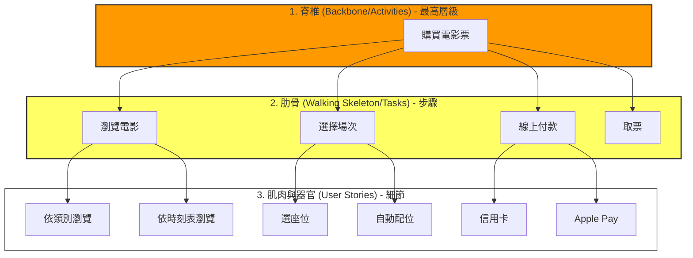

# 04. 用戶故事地圖 (User Story Mapping) 深度指南

> **"User Story Mapping is not about writing stories. It's about talking."**  
> — Jeff Patton (故事地圖發明者)

學會寫 User Story 之後，團隊往往會面臨一個災難：**「Product Backlog (產品待辦清單) 變成了一個巨大的垃圾桶」**。裡面堆滿了數百個 User Stories，沒有結構、看不出關聯、更不知道從何下手。

本章節將帶你深入學習 **User Story Mapping (用戶故事地圖)**，這不只是一個視覺化工具，更是一種**建立團隊共識 (Shared Understanding)** 的核心技術。

---

## 1. 核心觀念：為何「清單」會害死專案？

### 1.1 扁平化待辦清單 (Flat Backlog) 的三大死穴
在傳統 Scrum 中，Backlog 是一個由上而下的清單。但這種「一維」結構有致命傷：
1.  **見樹不見林 (Loss of Context)**：你看到「使用者可以修改密碼」，但你忘記了這是在「登入失敗」後才會發生的事。
2.  **優先級迷思 (Priority Trap)**：我們常把「容易做的」排在前面，而不是「對使用者最有價值的」。
3.  **碎片化 (Fragmentation)**：一個完整的體驗被切碎成數十個小故事，開發人員做完所有碎片，拼起來卻發現流程不順。

### 1.2 地圖的價值：找回「敘事線 (Narrative)」
人類是透過「說故事」來溝通的。故事地圖利用**二維結構**還原了使用者的真實旅程：
*   **橫軸 (X-Axis)**：**時間 (Time)**。使用者使用系統的故事順序。
*   **縱軸 (Y-Axis)**：**必要性 (Necessity)**。從「非做不可」到「有的話很棒」。

---

## 2. 地圖的解剖學 (The Anatomy)

一個標準的故事地圖由三個層級組成，請想像這是一具人體骨架：

1.  **使用者活動 (Activities)**：最上層的橘色便利貼。代表使用者的大目標。
    *   *例：管理帳戶、購買商品、撰寫文章。*
2.  **使用者任務 (User Tasks)**：第二層的黃色便利貼。為了完成活動，使用者必須執行的具體步驟。這構成了**脊椎 (Backbone)**。
    *   *例：為了「購買商品」，我需要「搜尋 -> 瀏覽 -> 加購物車 -> 結帳」。*
3.  **使用者故事 (User Stories)**：下方的白色便利貼。每一個任務可以有多種實作方式。
    *   *例：「結帳」可以用「信用卡」、「貨到付款」或「點數折抵」。*

---

## 3. 實戰六步驟 (Step-by-Step Workshop)

請準備一面大白板、三種顏色的便利貼、和你的團隊（包含工程師、設計師、PO）。

### Step 0: 定框 (Framing)
不要直接開始貼便利貼。先確認戰場範圍。
*   **Persona**: 我們現在是在講「誰」的故事？（是「第一次來訪的遊客」還是「熟練的管理員」？）
*   **Goal**: 這個產品要解決什麼核心問題？

### Step 1: 建立脊椎 (Build the Backbone)
讓大家安靜思考 3 分鐘，寫下使用者會做的主要步驟，然後貼上牆。
*   **關鍵提問**: 「使用者一開始會做什麼？接下來呢？然後呢？」
*   **整理**: 將重複的合併，依照時間順序由左至右排列。這就是你的 **X軸**。

### Step 2: 廣度優先填充 (Broad-brush the Body)
針對脊椎上的每一個步驟，向下延伸出具體的細節 (Stories)。
*   **關鍵提問**: 「在這個步驟中，使用者具體會做什麼？」、「有沒有別的替代方案？」、「如果出錯了怎麼辦？」
*   **規則**: 先求有，再求好。不要這時候就開始寫 Code 細節，寫「功能概念」即可。

### Step 3: 深度挖掘 (Deep Dive)
這時候工程師要介入了。
*   **關鍵提問**: 「這張『搜尋商品』的卡片，包含語音搜尋嗎？包含模糊搜尋嗎？要支援錯字校正嗎？」
*   **拆解**: 將一張大卡片拆成多張小卡片。這就是「顆粒度 (Granularity)」的調整。

### Step 4: 排序與修剪 (Prioritize & Prune)
現在你的牆上應該貼滿了便利貼。開始進行 **Y軸** 排列。
*   **原則**: 把「一定要有的 (Must have)」往上移，把「有了很棒 (Nice to have)」往下移。
*   **殘酷提問**: 「如果沒有這張卡片，使用者還能完成任務嗎？」如果可以，它就不該在第一排。

### Step 5: 切分發布 (Slice Releases)
拿出膠帶（或在軟體畫橫線），將地圖切成數個區塊。
*   **MVP (Minimum Viable Product)**: 第一條線。這不是「簡陋版」，而是「最小的完整體驗」。
*   **Release 2 / Release 3**: 後續的增強功能。

### Step 6: 轉移 (Transfer)
將第一條線（MVP）以上的故事，輸入到專案管理工具 (Jira/Trello/GitHub) 中，準備進入 Sprint 1。

---

## 4. 進階切分策略：什麼是真正的 MVP？

切分是故事地圖最難、也最有價值的藝術。

### 4.1 蛋糕的比喻 (Cake Metaphor)
*   **錯誤的切分 (Horizontal Slicing)**: 
    *   Sprint 1 做底層 (Database)
    *   Sprint 2 做中層 (API)
    *   Sprint 3 做上層 (UI)
    *   *結果：直到 Sprint 3 結束前，客戶什麼都吃不到。*
*   **正確的切分 (Vertical Slicing)**:
    *   Sprint 1 切一塊「薄薄的蛋糕」（包含 UI + API + DB）。
    *   *結果：客戶在 Sprint 1 就能吃到蛋糕（雖然很小塊），並告訴你好不好吃。*

### 4.2 常見的 MVP 錯誤
*   **誤區 1：MVP = 爛產品**。
    *   錯。MVP 必須是 "Viable" (可行的)。如果它是輪胎還沒裝好的車，它就不是 MVP。它應該是「滑板」（雖然簡陋，但能移動）。
*   **誤區 2：功能越多 = 越好**。
    *   故事地圖的目的是為了**「不做什麼」 (Maximize the amount of work not done)**。能砍掉的功能越多，你的 MVP 成功率越高。

---

## 5. 專題實作應用指南 (For Students)

學生專題最常見的問題是 **「想做的太大，最後做不完」**。請依照以下策略執行：

### 策略 1：針對「評審演示 (Demo)」做地圖
*   想像期末發表的 10 分鐘，你要演示什麼故事？
*   **只做** 那個故事需要的功能。其他的（例如：忘記密碼、修改個人頭像、關於我們）全部丟到 MVP 線下。

### 策略 2：尋找「骨架 (Walking Skeleton)」
*   在 Sprint 1，你的目標是打通脊椎。
*   雖然「登入」很醜，「搜尋」只能搜精確關鍵字，「結帳」只能按按鈕假裝成功。
*   但這證明了**系統架構是通的**。這比做了精美的登入頁面，但後面功能全是空的強上一百倍。

### 策略 3：用便利貼對抗「需求變更」
*   當指導老師說：「這裡加個 AI 推薦功能如何？」
*   帶他看故事地圖：「老師，AI 功能是很好的 Idea，我們把它寫在便利貼貼在 Release 3。但目前 MVP 線已經滿了，如果要把它移上去，我們要拿掉哪一張卡片？」
*   這展現了你們**管理範疇 (Scope Management)** 的專業能力。

---

### 延伸閱讀
*   **[實戰範例：早上起床的故事地圖](./04_範例_起床故事地圖_Example_Morning_Routine.md)** - 透過「起床」這個生活化案例，實際演練如何進行 Slicing。