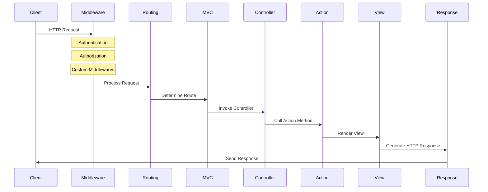

# ASP.NET Core MVC 專案結構

建立ASP.NET Core MVC的專案會產生專屬的檔案與資料夾，每個資料夾和文件都有其特定用途。  
以下是專案結構的路徑與說明，解釋它們各自的功能和意義：

## 專案結構

```bash
└──方案
    └──你建立的專案名稱
        ├── Connected Services         # 連接服務，用於整合Azure、Office 365或      其他第三方服務。
        ├── Dependencies               # 管理NuGet套件的地方，這些是專案所依賴的        外部程式庫。
        ├── Properties                 # 包含專案設定文件，如`launchSettings.       json`，用於配置專案啟動時的環境設置。
        ├── wwwroot                    # 存放專案的靜態資源，如CSS、JS和圖片，直        接對客戶端提供。
        │   ├── css
        │   ├── js
        │   └── lib
        ├── Controllers                # 包含控制器類別，這些類別用於處理來自使用       者的HTTP請求。
        │   ├── HomeController.cs
        │   └── OtherController.cs
        ├── Models                     # 包含數據模型類別，這些類別代表和管理應用       程式的數據。
        │   ├── ExampleModel.cs
        │   └── OtherModel.cs
        ├── Views                      # 包含Razor視圖檔案，為UI顯示數據並接受用        戶輸入。
        │   ├── Home
        │   │   ├── Index.cshtml
        │   │   └── About.cshtml
        │   └── Shared
        │       └── _Layout.cshtml
        ├── appsettings.json           # 應用程式的配置檔案，定義如連接字串、應用       程式設定等。
        └── Program.cs                 # 應用程式入口點，設置網頁主機和應用啟動。
```

## wwwroot資料夾

ASP.NET Core 專案的「wwwroot」資料夾通常被視作是網站的根目錄。  
這個資料夾裡可以放置各種`靜態檔案`，像是 `JavaScript`、`CSS` 樣式表、`圖片`或是其他`第三方函式庫`檔案。這些檔案可以通過相對於根目錄的路徑來存取。

### **注意事項**

>在過往的 ASP.NET 應用程式中，靜態檔案通常可以存放在該應用程式的根目錄或任何子目錄下，並且可以直接被提供給用戶端透過網址使用。  
但在 ASP.NET Core 中，只有存放在「wwwroot」資料夾中的檔案，才能夠透過 HTTP 請求來存取。除了「wwwroot」資料夾外的檔案預設是不對外開放的。

### **存取方法**

>在「wwwroot」資料夾裡，通常會依照檔案類型分成不同的子資料夾，如 JavaScript、CSS、images 等。  
假如你有一個名為「app.css」的 CSS 檔案，並且放在「css」子資料夾中，那麼你可以透過網址「<http://你的網站網址>/css/app.css」來訪問這個檔案。

### **檔案結構**

```bash
├── wwwroot 
   ├── css  #CSS放置位置
   ├── js   #Js放置位置
   └── lib  #
```

## ASP.NET Core mvc 的生命週期

.NET 6 開始，ASP.NET Core 推出了一種更簡潔的應用程式啟動和配置模型，其中包含minimal APIs 與 Top Level Statements，所以用.NET6以上的版本建立ASP .NET Core MVC專案與過往.NET5以前的版本會有不同。
>例如早期有startup.cs，現在則從Program.cs開始

### 生命週期主要階段

1. **應用程式啟動（Program.cs）**:
   - 應用程式的入口點是 `Program.cs` 檔案。在這裡，你可建立和配置 `WebApplication` 和 `WebApplicationBuilder`，包括設定服務、中間件以及其他必要的設置。

2. **依賴注入（Dependency Injection）**:
   - 在 `Program.cs` 中，你可以配置依賴注入容器，為應用程式提供所需的服務，例如資料庫、日誌記錄、配置設置等。

3. **路由（Routing）**:
   - 路由決定了如何將進來的 HTTP 請求映射到控制器動作。在 `Program.cs` 或控制器中定義路由模板。

4. **中間件（Middleware）**:
   - 在 `Program.cs` 中配置中間件。中間件是一系列處理 HTTP 請求和響應的組件。它們按順序執行，可以進行請求處理、響應處理或兩者兼顧。

5. **控制器和動作（Controllers and Actions）**:
   - 控制器處理對特定路由的請求。控制器中的動作方法會根據路由和 HTTP 方法來處理請求。

6. **過濾器（Filters）**:
   - 過濾器在特定的階段，例如授權、動作執行前後，提供了一個執行自定義代碼的機會。

7. **結果處理（Result Execution）**:
   - 動作方法返回的結果（例如視圖、文件、JSON 等）將被處理並發送給客戶端。

8. **異常處理（Exception Handling）**:
   - 異常過濾器和中間件可以用來攔截和處理應用程式中出現的異常。

9. **請求結束**:
   - 請求完成後，響應被發送到客戶端，並且對該請求的處理過程結束。

### Program.cs

應用程式的入口點

```cs
var builder = WebApplication.CreateBuilder(args);

// Add services to the container.
builder.Services.AddControllersWithViews();

var app = builder.Build();

// Configure the HTTP request pipeline.
if (!app.Environment.IsDevelopment())
{
    app.UseExceptionHandler("/Home/Error");
}
app.UseStaticFiles();

app.UseRouting();
app.UseAuthorization();

app.MapControllerRoute(
    name: "default",
    pattern: "{controller=Home}/{action=Index}/{id?}");

app.Run();
```

-----------------

### 方法詳解

```csharp
var builder = WebApplication.CreateBuilder(args);
```

- 創建了一個 `WebApplicationBuilder` 的實例，用於設置和配置應用程式。`args` 是傳遞給程式的命令列參數。

底層執行了一系列重要的步驟來設置和準備 Web 應用程序。這些步驟包括：

1. **創建和配置 Host**:
   - `CreateBuilder` 方法首先創建一個 `HostBuilder` 實例。主機（Host）是負責應用程序啟動和生命週期的基本組件。
   - 它使用 `args` 參數，這些通常是從命令行傳入的參數，來允許從外部設定應用程序。

2. **配置預設服務**:
   - 預設的服務，如日誌記錄、配置和依賴注入容器，被添加到服務容器中。這為應用程序提供了核心功能。

3. **加載應用程序設定**:
   - 讀取和解析應用程序的配置設定，這可能來自多個來源，如 `appsettings.json` 文件、環境變量、命令行參數等。
   - 配置系統以一種靈活的方式工作，允許開發者根據需要自定義設定來源。

4. **設置環境**:
   - 確定應用程序運行的環境，如開發、測試或生產。這通常通過環境變量來設定，並影響配置選擇和日誌記錄行為。

5. **配置 Web 服務**:
   - 配置用於 Web 應用程序的特定服務，例如設置 Kestrel 作為 Web 服務器。
   - 也為後續添加的任何中間件或 MVC 功能提供了基礎。

6. **返回 WebApplicationBuilder**:
   - 最後，方法返回一個 `WebApplicationBuilder` 的實例。這個實例提供了進一步配置應用程序的方法，包括添加中間件、設定路由、配置服務等。

-----------------

```csharp
builder.Services.AddControllersWithViews();
```

- 在依賴注入容器中添加 MVC 控制器和視圖的支持。這使得應用程式能夠處理來自 Web 控制器的請求並返回視圖。

-----------------

```csharp
var app = builder.Build();
```

- 使用之前設定的 `builder` 來構建 `WebApplication` 的實例。這個實例代表應用程式本身，並且用於配置 HTTP 請求管道。

-----------------

```csharp
if (!app.Environment.IsDevelopment())
{
    app.UseExceptionHandler("/Home/Error");
}
```

- 檢查應用程式是否在開發環境中運行。如果不是，則使用異常處理中間件來捕捉並處理未處理的異常，將用戶重定向到 `/Home/Error` 路徑。

-----------------

```csharp
app.UseStaticFiles();
```

- 啟用靜態文件支持。這允許應用程式提供靜態資源，如圖片、CSS 文件和 JavaScript 文件。

-----------------

```csharp
app.UseRouting();
```

- 添加路由中間件，它是用來決定如何將進來的 HTTP 請求路由到相應的控制器和動作方法。

-----------------

```csharp
app.UseAuthorization();
```

- 添加授權中間件，這確保在路由決策之後但在執行控制器動作之前進行授權檢查。

-----------------

```csharp
app.MapControllerRoute(
    name: "default",
    pattern: "{controller=Home}/{action=Index}/{id?}");
```

- 定義了一個 MVC 控制器路由。這裡設定了一個名為 "default" 的路由模式，其中 `{controller=Home}` 表示控制器的默認值是 "Home"，`{action=Index}` 表示動作方法的默認值是 "Index"，而 `{id?}` 則表示一個可選的 id 參數。

-----------------

```csharp
app.Run();
```

- 啟動應用程式並開始監聽進來的 HTTP 請求。

## 生命週期時序圖



1. **中間件（Middleware）** - 處理如身份驗證、授權、其他自定義中間件的任務。
2. **路由（Routing）** - 確定請求應該由哪個控制器和動作處理。
3. **MVC** - MVC 框架的核心處理。
4. **控制器（Controller）** - 接收請求並調用相應的動作方法。
5. **動作（Action）** - 執行業務邏輯，可能會與模型交互並選擇視圖。
6. **視圖（View）** - 渲染 HTML 響應。
7. **回應（Response）** - 將生成的 HTTP 響應發送回客戶端。

這個序列圖為 ASP.NET Core MVC 應用程序的請求處理流程提供了一個高層次的概述。
