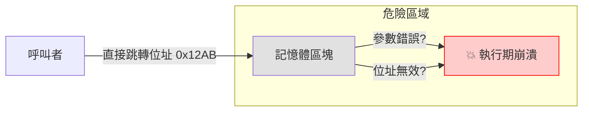
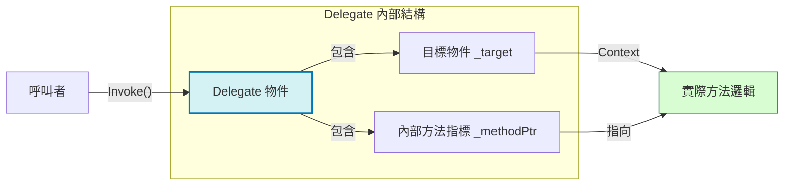
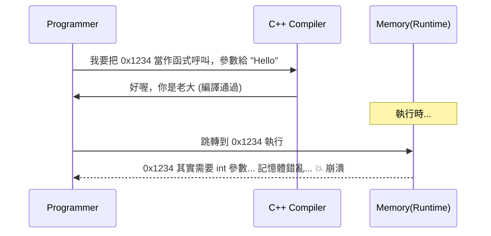
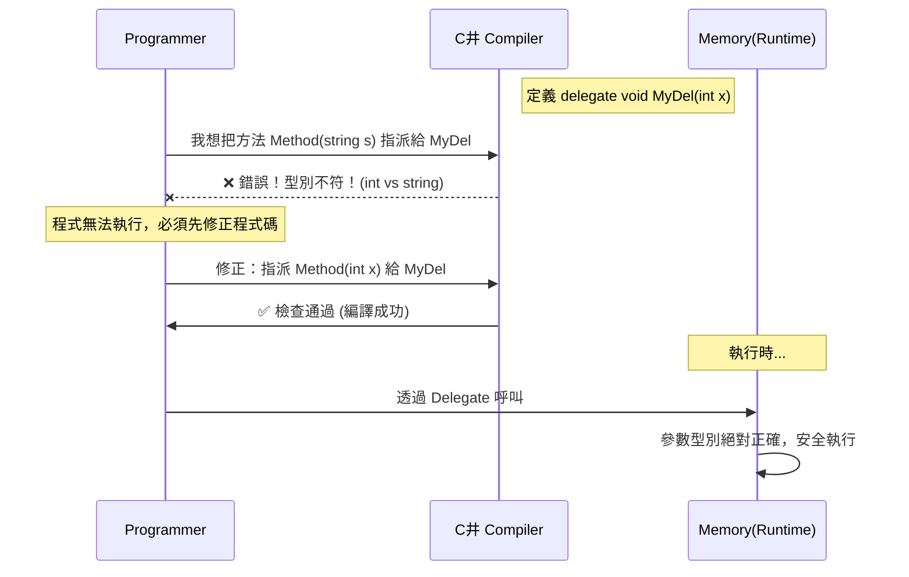

# 補充解析：為何說 Delegate 是「型別安全的指標」？

這句話包含了兩個電腦科學的重要概念：**「指標 (Pointer)」** 與 **「型別安全 (Type-Safe)」**。讓我們透過圖解與對比來徹底理解。

---

## 1. 什麼是「指標 (Pointer)」？

在 C 或 C++ 等較底層的語言中，函式 (Function) 其實就是**記憶體中的一段程式碼**。這段程式碼有一個起始的記憶體位址（例如 `0x7FFF00A1`）。

當我們說「指標」時，意思就是**「拿著這個記憶體位址」**。

### C/C++ 的函式指標 (Function Pointer) - 危險的自由
在 C 語言中，你可以拿到任何函式的位址並執行它。但這就像**拿著一張只寫了地址的小紙條**：
1.  你到了地址，發現那裡可能已經不是原本的店家了（記憶體被回收或覆蓋）。
2.  你想進去買漢堡，但那其實是一間五金行（參數型別不對，例如方法需要 `int` 你卻傳了 `string`）。
3.  **結果**：程式直接崩潰 (Crash) 或產生不可預期的亂碼。



---

## 2. 什麼是「Delegate (委派)」？

C# 的 Delegate 不僅僅是一個位址，它是一個 **物件 (Object)**。它就像是一張**「官方正式邀請函」**。

這張邀請函（Delegate 物件）裡面包含兩樣關鍵資訊：
1.  **方法指標 (`_methodPtr`)**：要去哪裡執行代碼（記憶體位址）。
2.  **目標物件 (`_target`)**：這段代碼屬於哪個物件實體（如果是 static 方法則為 null）。

### C# 的 Delegate - 安全的封裝
當你建立 Delegate 時，C# 編譯器會嚴格檢查這張「邀請函」的規格：
*   **檢查**：你要傳的參數是 `int` 嗎？
*   **檢查**：回傳值是 `string` 嗎？
*   **結果**：如果規格不符，**程式連編譯都不會通過**（紅底波浪線），根本不會讓你有機會在執行時崩潰。



---

## 3. 視覺化比較：裸指標 vs 委派

讓我們用 Mermaid 流程圖來對比兩者的運作流程差異。

### 3.1 C/C++ 裸指標 (Raw Pointer)
完全信任程式設計師，編譯器不負責任。



### 3.2 C# 委派 (Type-Safe Delegate)
編譯器如同嚴格的警衛，這就是所謂的「型別安全」。



---

## 4. 程式碼演示

### 模擬錯誤情境

```csharp
// 定義一個需要 int 的委派
public delegate void IntDelegate(int x);

public class Demo
{
    public void StringMethod(string s) 
    {
        Console.WriteLine(s);
    }

    public void Run()
    {
        // C# 的型別安全機制：
        // 這一行會直接顯示紅色錯誤，無法編譯。
        // 因為 "IntDelegate" 規定要吃 int，但你卻給了吃 string 的方法。
        
        // IntDelegate myDel = new IntDelegate(StringMethod); // <--- 編譯錯誤 CS0123
        
        // 如果是在 C 語言使用 void* 指標，這行可能就過了，然後在執行時爆炸。
    }
}
```

## 5. 總結

| 特性 | C/C++ 函式指標 | C# Delegate |
| :--- | :--- | :--- |
| **本質** | 單純的記憶體位址 (Address) | 包含位址與目標的完整物件 (Object) |
| **參數檢查** | 執行期可能不檢查 (依賴轉型) | **編譯期**嚴格檢查 (Compile-time Check) |
| **安全性** | 不安全 (Unsafe) | **型別安全 (Type-Safe)** |
| **多播能力** | 無 (只能指一個) | 內建支援 (Multicast, +=) |

所以，當我們說 **「Delegate 是型別安全的指標」**，意思是它保留了指標「動態指向不同方法」的靈活度，但去除了傳統指標「容易指錯、參數亂傳」的危險性。
