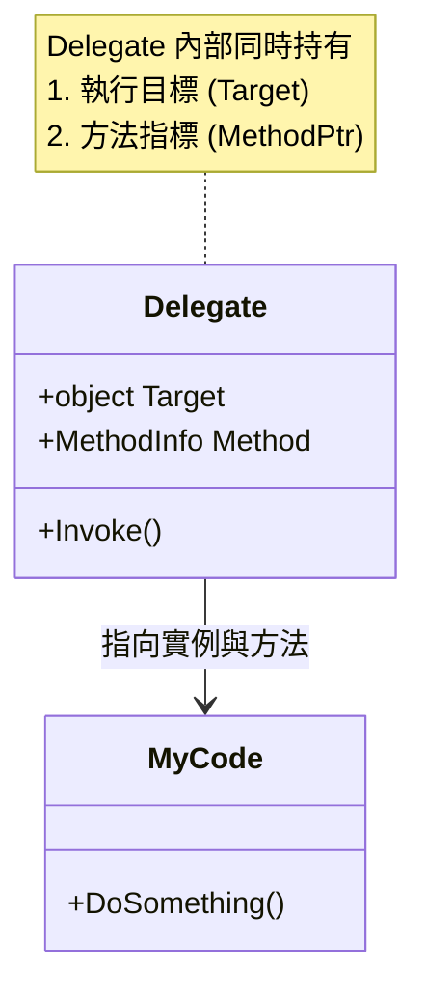
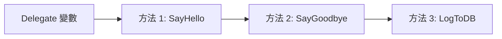
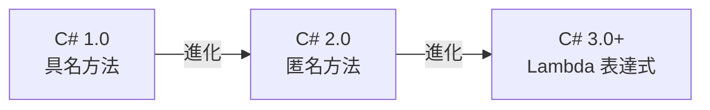
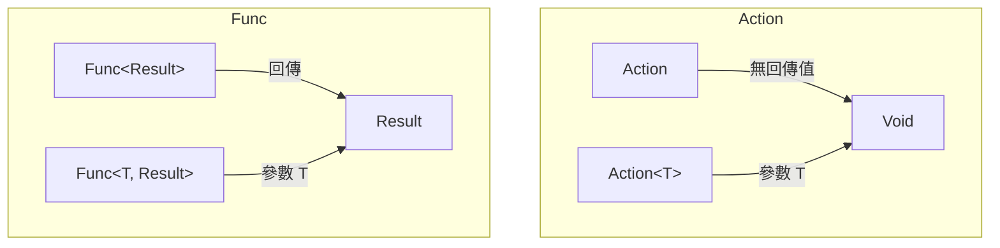
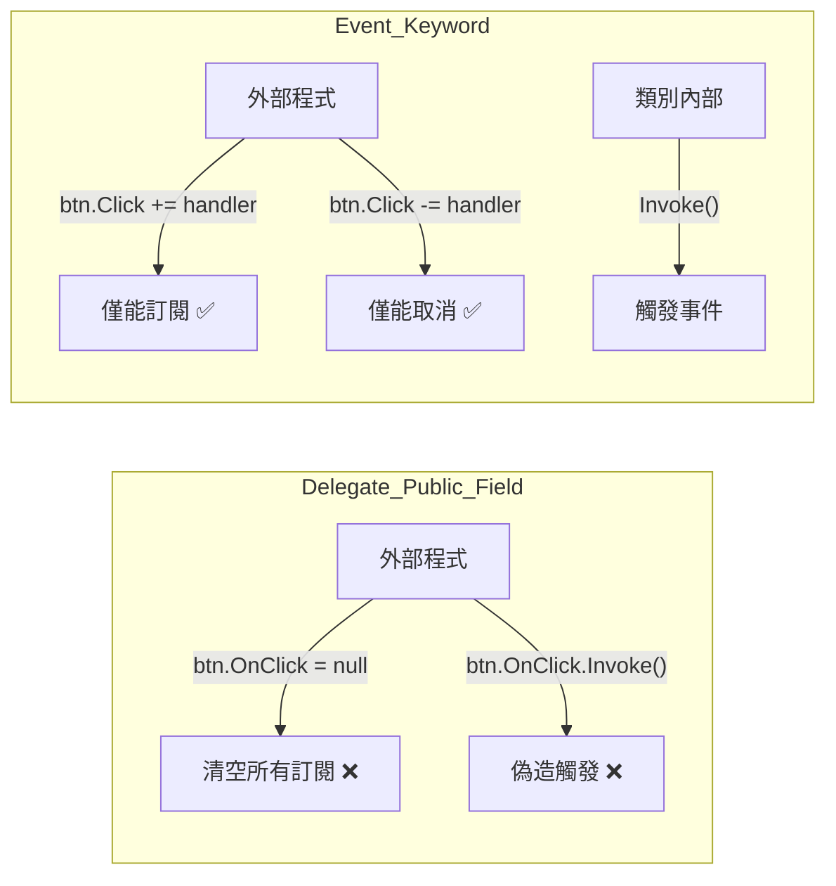
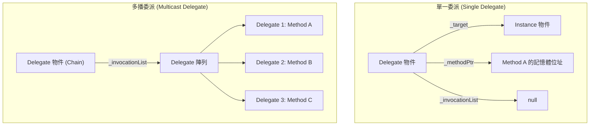

# C# 核心機制：Delegate, Action, Func 與 Event 完整解析

這份文件將帶你深入了解 C# 中最重要但也最容易混淆的概念：**委派 (Delegate)**。我們會從最底層的原理開始，一路講到現代 C# 開發中常用的 `Action` 與 `Func`，最後解釋 **事件 (Event)** 到底是為了解決什麼問題而存在的。

---

## 1. 什麼是委派 (Delegate)？

在 C# 中，變數通常用來儲存資料（如 `int`, `string`）。但如果我們想**把「方法 (Method)」當作參數傳遞**，或者**把「方法」存進變數裡**，該怎麼做？

這就是 **Delegate** 的用途。簡單來說，**Delegate 就是一個「指向方法的指標 (Pointer)」**，但它是型別安全的。

### 1.1 核心架構：Delegate 的本質

與 C/C++ 的函式指標不同，Delegate 是一個**物件**。它不僅包含方法的位址，還包含方法所屬的**目標物件 (Target Object)**。



### 1.2 定義與使用 (C# 1.0 風格)

要使用委派，通常分為三個步驟：
1.  **宣告委派型別**：定義這個委派能接收什麼樣的方法（參數與回傳值必須匹配）。
2.  **實例化委派**：建立委派物件，並指派目標方法。
3.  **呼叫 (Invoke)**：執行委派。

```csharp
using System;

namespace DelegateDemo
{
    // 1. 宣告委派型別
    //這代表：MyDelegate 只能儲存「沒有回傳值(void)，且接收一個 string 參數」的方法
    public delegate void MyDelegate(string message);

    class Program
    {
        // 符合委派簽章的方法 A
        public static void SayHello(string name)
        {
            Console.WriteLine($"Hello, {name}!");
        }

        // 符合委派簽章的方法 B
        public static void SayGoodbye(string name)
        {
            Console.WriteLine($"Goodbye, {name}!");
        }

        static void Main(string[] args)
        {
            // 2. 實例化委派，指向 SayHello 方法
            MyDelegate methodPointer = new MyDelegate(SayHello);

            // 3. 呼叫 (Invoke)
            methodPointer("User"); // 輸出: Hello, User!
            
            // 也可以用 Invoke 方法明確呼叫
            methodPointer.Invoke("Admin"); 

            // 切換指向的方法
            methodPointer = SayGoodbye;
            methodPointer("User"); // 輸出: Goodbye, User!
        }
    }
}
```

### 1.3 多播委派 (Multicast Delegate)

委派的一個強大特性是「多播」。一個委派變數可以同時包含多個方法。使用 `+=` 加入方法，使用 `-=` 移除方法。它內部其實是一個**鏈結串列 (Invocation List)**。



```csharp
MyDelegate multiOp = SayHello;
multiOp += SayGoodbye; // 現在這個委派變數同時「拿著」兩個方法

// 呼叫時，會依序執行 SayHello 然後執行 SayGoodbye
multiOp("World"); 
// 輸出:
// Hello, World!
// Goodbye, World!
```

**注意：** 如果多播委派有回傳值，呼叫後只會拿到**最後一個方法**的回傳值，前面的回傳值會被丟棄。

---

## 2. 歷史演進：從 1.0 到 Lambda (語法糖的進化)

隨著 C# 版本的更新，寫法越來越簡潔。理解這段歷史能幫助你讀懂舊程式碼與現代程式碼。

### 演進圖譜



假設我們有一個計算用的委派：
`public delegate int MathOp(int a, int b);`

### C# 1.0：具名方法 (Named Method)
必須先定義一個獨立的方法，再指派給委派。

```csharp
public int Add(int a, int b) { return a + b; }
// ...
MathOp op = new MathOp(Add);
```

### C# 2.0：匿名方法 (Anonymous Method)
允許直接在宣告時寫邏輯，不用特地去外面開一個方法。引入了 `delegate` 關鍵字作為運算子。

```csharp
MathOp op = delegate(int a, int b) 
{
    return a + b;
};
```

### C# 3.0+：Lambda 表達式 (Lambda Expression)
這是現代最常見的寫法。使用 `=>` (Goes to) 運算子。編譯器會自動推斷型別。

```csharp
// 完整寫法
MathOp op = (int a, int b) => { return a + b; };

// 簡化寫法 (自動推斷型別，單行省略 return 與大括號)
MathOp op2 = (a, b) => a + b;
```

#### 進階知識點：閉包 (Closure)
當 Lambda 或匿名方法使用了外部變數時，會產生**閉包**。C# 編譯器會自動生成一個類別來捕捉這些變數，延長它們的生命週期。

```csharp
int factor = 10;
Func<int, int> multiplier = x => x * factor; 
// 即使離開當前 scope，factor 依然會被 multiplier 記住
```

---

## 3. Action 與 Func：現代 C# 的標準

在早期的專案中，開發者必須為了不同的參數宣告一大堆自訂的 Delegate。為了統一標準，.NET Framework 3.5 引入了泛型委派：**Action** 與 **Func**。

**現在的開發準則：除非有特殊語意需求（如 `ThreadStart`），否則盡量使用 `Action` 與 `Func`。**

### Action vs Func 視覺化



### 3.1 Action (無回傳值)
`Action` 專門用來處理 **沒有回傳值 (void)** 的方法。

*   `Action`: 0 個參數，回傳 void。
*   `Action<T>`: 1 個參數 T，回傳 void。
*   `Action<T1, T2>`: 2 個參數，回傳 void。
*   (最多可支援 16 個參數)

```csharp
Action<string, int> logMessage = (msg, level) => 
{
    Console.WriteLine($"[Level {level}] {msg}");
};
logMessage("System Start", 1);
```

### 3.2 Func (有回傳值)
`Func` 專門用來處理 **有回傳值** 的方法。
**注意：泛型參數的「最後一個」永遠是回傳值的型別。**

*   `Func<TResult>`: 0 個參數，回傳 TResult。
*   `Func<T, TResult>`: 1 個參數 T，回傳 TResult。
*   `Func<T1, T2, TResult>`: 2 個參數 (T1, T2)，回傳 TResult。

```csharp
Func<int, int, int> add = (x, y) => x + y;
int result = add(5, 10); // 15
```

---

## 4. 事件 (Event)：委派的封裝與保護

這是許多初學者最困惑的地方：**既然有了 Delegate/Action，為什麼還需要 Event？**

### 4.1 委派 vs 事件：權限差異

`Delegate` 就像是一個公開的公佈欄，任何人都可以去撕掉別人的公告（賦值 null），或者隨意發布假消息（外部 Invoke）。
`Event` 就像是一個訂閱制的電子報，你只能**訂閱**或**取消訂閱**，只有發行商（類別內部）可以決定何時發送。



### 4.2 標準 Event 實作範例

.NET 慣用的 Event 模式通常包含：
1.  一個繼承自 `EventArgs` 的類別 (傳遞資料用)。
2.  使用 `EventHandler<T>`。
3.  一個 `On...` 的受保護虛擬方法 (用來觸發事件)。

```csharp
using System;

namespace EventDemo
{
    // 1. 定義事件資料
    public class VideoEncodedEventArgs : EventArgs
    {
        public string Title { get; set; }
        public int Size { get; set; }
    }

    // 發布者 (Publisher)
    public class VideoEncoder
    {
        // 2. 宣告事件 (使用標準 EventHandler)
        // 這本質上是一個 Action<object, VideoEncodedEventArgs>
        public event EventHandler<VideoEncodedEventArgs> VideoEncoded;

        public void Encode(string title)
        {
            Console.WriteLine($"Encoding {title}...");
            System.Threading.Thread.Sleep(1000); // 模擬工作

            // 3. 觸發事件
            OnVideoEncoded(title, 500);
        }

        protected virtual void OnVideoEncoded(string title, int size)
        {
            // ?.Invoke 是 C# 6.0 的簡化寫法，線程安全
            VideoEncoded?.Invoke(this, new VideoEncodedEventArgs { Title = title, Size = size });
        }
    }

    // 訂閱者 (Subscriber)
    public class MailService
    {
        public void OnVideoEncoded(object source, VideoEncodedEventArgs e)
        {
            Console.WriteLine($"EmailService: Sending email for {e.Title}, size: {e.Size}MB");
        }
    }

    class Program
    {
        static void Main()
        {
            var encoder = new VideoEncoder();
            var mailService = new MailService();

            // 訂閱事件
            encoder.VideoEncoded += mailService.OnVideoEncoded;
            
            encoder.Encode("IronMan_Trailer.mp4");
        }
    }
}
```

---

## 5. 底層原理 (Under the Hood) - 為什麼它能運作？

這一節稍微硬派一點，但理解後你會對 C# 有完全不同的認識。

### 5.1 驚人的事實：Delegate 其實是一個「類別 (Class)」

當你在程式碼寫下這一行時：
```csharp
public delegate void MyDelegate(string msg);
```

你以為你只是定義了一個函式指標？不，**編譯器在背後偷偷幫你寫了一個完整的類別**。這就是為什麼你可以 `new MyDelegate(...)` 的原因。

這個自動產生的類別大概長這樣（簡化版 IL 邏輯）：

```csharp
// 編譯器自動產生的類別，繼承自 System.MulticastDelegate
public class MyDelegate : System.MulticastDelegate
{
    // 建構子：接收「目標物件」與「方法位址」
    public MyDelegate(object target, IntPtr methodPtr) { ... }

    // Invoke 方法：這就是你呼叫委派時真正執行的地方
    public virtual void Invoke(string msg) { ... }

    // 非同步執行用 (現代通常用 Task 取代)
    public virtual IAsyncResult BeginInvoke(...) { ... }
    public virtual void EndInvoke(...) { ... }
}
```

### 5.2 記憶體中的長相 (Memory Layout)

不管是哪種 Delegate，內部都藏著三個最關鍵的欄位：

1.  **`_target` (System.Object)**:
    *   如果你指向的是 **實體方法 (Instance Method)**，這裡存的就是那個物件實體 (`this`)。
    *   如果你指向的是 **靜態方法 (Static Method)**，這裡是 `null`。
2.  **`_methodPtr` (System.IntPtr)**:
    *   這就是真正的 **記憶體位址**，指向要執行的程式碼。
3.  **`_invocationList` (System.Object)**:
    *   **單播 (Single Cast)**：這裡是 `null`。
    *   **多播 (Multicast)**：這裡會存一個 `Delegate[]` 陣列，裡面依序裝著所有要執行的方法。

#### 視覺化圖解：單播 vs 多播



### 5.3 為什麼字串串接用 `+=`，委派也用 `+=`？(不可變性)

這是一個很重要的觀念：**Delegate 是「不可變的 (Immutable)」**。

當你執行 `myDel += NewMethod;` 時，並不是把 `NewMethod` 塞進原本的物件裡。
相反地，系統會：
1.  建立一個 **全新的 Delegate 物件**。
2.  把舊清單複製過去。
3.  把新方法加到後面。
4.  讓變數指向這個**新物件**。

這跟 `string` 的行為一模一樣。這也是為什麼在迴圈中大量對 Delegate 做 `+=` 會有輕微的效能損耗（因為一直 new 新物件），但在一般應用場景中通常可以忽略。

### 5.4 協變性與逆變性 (Covariance & Contravariance)

這是 Delegate 的進階特性，讓你的程式碼更有彈性：

*   **協變性 (Covariance) - 回傳值可以更具體**
    *   例如：委派規定回傳 `Animal`，你的方法回傳 `Dog` (繼承自 Animal)。
    *   `Func<Animal> getDog = () => new Dog();` // 合法！
*   **逆變性 (Contravariance) - 參數可以更寬鬆**
    *   例如：委派規定要傳入 `Dog`，你的方法可以處理 `Animal` (所有動物)。
    *   `Action<Dog> handleDog = (Animal a) => Console.WriteLine("這是一隻動物");` // 合法！

---

## 6. 總結比較表

| 特性 | Delegate (自訂) | Action | Func | Event |
| :--- | :--- | :--- | :--- | :--- |
| **用途** | 定義函式簽章 (基底) | 指向無回傳值的方法 | 指向有回傳值的方法 | 實現發布/訂閱模式 |
| **回傳值** | 可自訂 | 必須是 void | 泛型最後一個參數 | (通常是 void) |
| **語法簡潔度** | 繁瑣 (需先宣告型別) | 簡潔 (內建) | 簡潔 (內建) | 需搭配 delegate 使用 |
| **安全性** | 低 (外部可 Invoke/Clear) | 低 (外部可 Invoke/Clear) | 低 (外部可 Invoke/Clear) | **高** (外部僅能 +=/-=) |
| **主要場景** | 與非託管程式碼 (C++) 互動 | 一般回呼、UI 邏輯 | LINQ、計算邏輯 | GUI 按鈕、系統通知 |

### 快速記憶口訣
*   單純想傳方法，沒回傳值 -> 用 **Action**
*   單純想傳方法，有回傳值 -> 用 **Func**
*   想要做「通知」功能，且不希望外部搞破壞 -> 用 **Event**