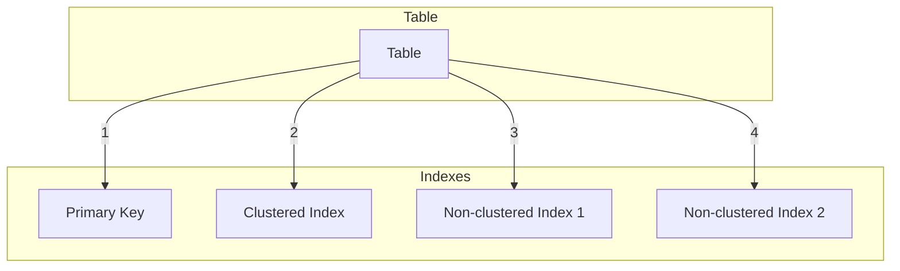
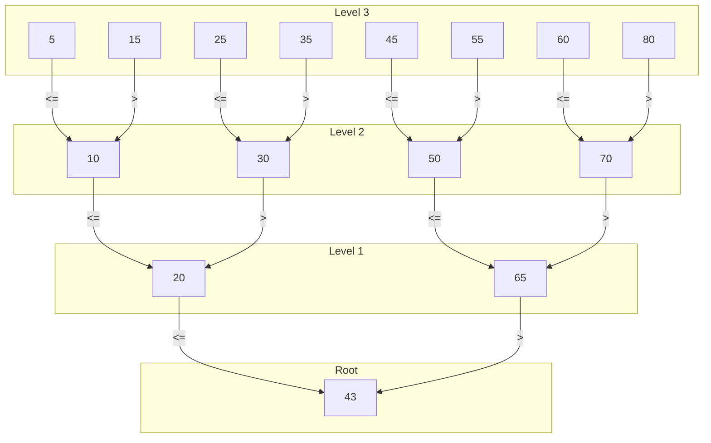

```mermaid
graph TD
  subgraph "Table"
    A[Table]
  end

  subgraph "Indexes"
    B[Primary Key]
    C[Clustered Index]
    D[Non-clustered Index 1]
    E[Non-clustered Index 2]
  end

  A -->|1| B
  A -->|2| C
  A -->|3| D
  A -->|4| E

```

```mermaid
graph TD
  subgraph "Root"
    A[43]
  end

  subgraph "Level 1"
    B[20] -->|<=| A
    C[65] -->|>| A
  end

  subgraph "Level 2"
    D[10] -->|<=| B
    E[30] -->|>| B
    F[50] -->|<=| C
    G[70] -->|>| C
  end

  subgraph "Level 3"
    H[5] -->|<=| D
    I[15] -->|>| D
    J[25] -->|<=| E
    K[35] -->|>| E
    L[45] -->|<=| F
    M[55] -->|>| F
    N[60] -->|<=| G
    O[80] -->|>| G
  end

```

https://www.cs.usfca.edu/~galles/visualization/BTree.html