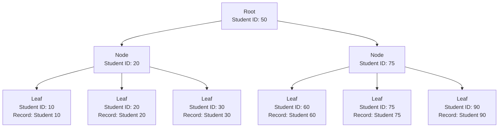
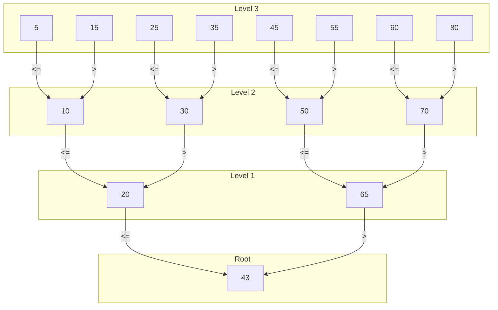

# 索引

## B-Tree和B+Tree

1. **B-Tree**：
   - B-Tree是一種平衡樹結構，通常用於資料庫和文件系統。
   - 它能夠保持數據在多個頁面（或磁盤塊）中的排序，並允許快速的插入、刪除和搜索操作。
   - 在B-Tree中，每個節點可能有多個子女，且數據分佈在整棵樹中。

2. **B+Tree**：
   - B+Tree是B-Tree的一種變體，它將所有的數據存儲在葉子節點中，而非葉子節點（即內部節點）存儲指向這些葉子節點的指針。
   - B+Tree的葉子節點之間通常是相互鏈接的，這便於範圍查詢。
   - B+Tree通常在資料庫索引中使用，因為它們提供了對數據的快速訪問，並且對於範圍查詢更有效。

## SQL Server中的索引

在SQL Server中，索引主要是基於B+Tree結構實現的：

1. **叢集索引**：
   - 在SQL Server中，叢集索引決定了表中數據的物理排序。
   - 每個表只能有一個叢集索引，因為數據行本身就是按索引鍵的順序存儲的。
   - 叢集索引的B+Tree結構中的葉子節點直接包含數據行。

2. **非叢集索引**：
   - 非叢集索引包含索引鍵值和指向包含實際數據行的數據頁面的指針。
   - 一個表可以有多個非叢集索引。
   - 在非叢集索引的B+Tree結構中，葉子節點不直接存儲數據行，而是存儲指向數據的指針。

## 索引的工作原理

1. **搜索操作**：
   - 當進行搜索操作時，SQL Server從B+Tree的根節點開始，根據索引鍵逐級向下導航，直到達到葉子節點。
   - 對於叢集索引，葉子節點即是數據行；對於非叢集索引，葉子節點提供了指向實際數據行的指針。

2. **插入和刪除操作**：
   - 當插入或刪除行時，SQL Server會更新相應的索引結構，確保數據和索引的一致性。
   - B+Tree結構確保了這些操作的效率，並維持了數據的排序和平衡狀態。

## 索引破碎

索引破碎在SQL Server中是一個常見問題，它指的是索引中的數據頁面的物理順序和邏輯順序不一致的情況。這通常發生在對數據庫進行大量的插入、更新或刪除操作之後。當索引破碎時，會導致幾個問題：

### 1. **性能下降**

- 索引破碎會導致數據庫引擎在檢索數據時需要更多的I/O操作，因為數據頁面不是按順序存儲的。這增加了查詢數據的時間，尤其是對於範圍查詢。

### 2. **增加I/O成本**

- 當數據頁面散布在硬盤上時，數據庫需要進行更多的磁盤讀寫操作來訪問這些頁面。這不僅降低了查詢效率，還可能增加整體系統的I/O負擔。

### 3. **降低緩存效率**

- 緩存（如SQL Server的緩衝池）效率可能受到影響。索引破碎意味着緩存中相關的數據頁面可能不連續，這降低了緩存的有效性。

### 4. **影響索引維護**

- 索引維護，如重建索引或重新組織索引的操作，可能會因為破碎而變得更加頻繁，這可能對數據庫的維護工作量產生額外的影響。

### 5. **占用更多的存儲空間**

- 索引破碎可能導致索引佔用更多的存儲空間，因為它可能產生額外的數據頁面。

### 解決方案

為了解決索引破碎的問題，數據庫管理員通常會定期進行索引重建（Rebuild）或索引重新組織（Reorganize）的操作：

- **索引重建**：這是一種更徹底的維護操作，會重新構建整個索引。這可以完全消除破碎，但通常需要更多的時間和資源。
- **索引重新組織**：這是一種較輕量的操作，它只重新排列索引中的數據頁面，以減少破碎。這個過程通常比重建索引快，但不會完全消除破碎。

## 圖

<https://www.cs.usfca.edu/~galles/visualization/BTree.html>
