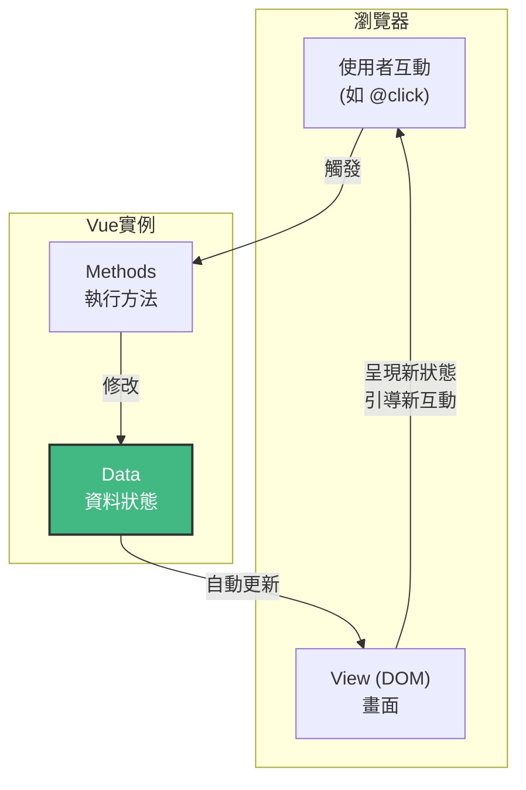

# **重構版：3. 資料綁定與方法**

在上一章，我們成功地將靜態文字 `{{ message }}` 顯示在頁面上。現在，我們將學習如何讓頁面變得有互動性。這需要我們掌握 Vue 中最核心的四個概念，它們共同構成了一個完整的資料驅動迴圈。

---

## **3.1 我們的目標：一個互動式計數器**

讓我們先看一下本章要完成的最終成果。這是一個簡單但功能完整的互動式元件：

```html
<!-- 最終的 HTML 效果 -->
<div id="app">
    <p>目前的數量: 0</p>
    <button>增加</button>
    <button>減少</button>
    <!-- 當數量為 0 時，「減少」按鈕將被禁用 -->
</div>
```

為了實現這個效果，我們需要：
1.  用**資料 (Data)** 來表示「數量」。
2.  用**方法 (Methods)** 來定義「增加」和「減少」的行為。
3.  用**事件綁定 (v-on)** 來讓按鈕能夠觸發這些方法。
4.  用**屬性綁定 (v-bind)** 來根據數量動態地禁用按鈕。

## **3.2 第一步：用 `data` 描述狀態**

首先，我們需要在 Vue 中定義一個地方來儲存我們的「數量」。這就是 `data` 選項的職責。`data` 是 Vue 實例的「心臟」，它是一個函式，並且**必須回傳一個物件**。這個物件中定義的所有屬性，都會被 Vue 的響應式系統所追蹤。

```javascript
const app = Vue.createApp({
    data() {
        return {
            count: 0,
            // 您可以在這裡定義更多資料
            productName: '神奇小工具'
        }
    }
});
```
*   **`count: 0`**：我們定義了一個名為 `count` 的資料屬性，初始值為 0。
*   **為何 `data` 必須是函式？** 這在我們後面學習「組件」時會變得至關重要。簡單來說，這能確保每個組件實例都擁有自己獨立的資料複本，互不干擾。

## **3.3 第二步：用 `methods` 定義行為**

有了資料，我們還需要定義如何去改變它。`methods` 選項允許我們定義一些函式，這些函式通常用來回應使用者的事件。

在 `methods` 中定義的函式，其內部的 `this` 會自動指向 Vue 的實例。這意味著您可以透過 `this.count` 來存取 `data` 中的資料。

```javascript
const app = Vue.createApp({
    data() { /* ... */ },
    methods: {
        // 增加計數
        increment() {
            this.count++;
        },
        // 減少計數，並確保不小於 0
        decrement() {
            if (this.count > 0) {
                this.count--;
            }
        },
        // 接受參數的方法：增加指定數量
        addAmount(amount) {
            this.count += amount;
        },
        // 執行一些簡單的驗證邏輯
        submitForm() {
            if (this.count < 0) {
                alert('計數不能為負數！');
                return;
            }
            // 這裡可以執行提交表單到後端的邏輯
            console.log('表單已提交，計數為:', this.count);
        }
    }
});
```
**核心觀念轉變**：請注意，這些方法的核心職責是**修改資料 (`this.count`)** 或執行與資料相關的邏輯。我們完全沒有去碰觸 HTML 或 DOM。這就是 Vue 的資料驅動思想——您只需要關心資料的狀態，Vue 會自動幫您更新畫面。

> #### 深入探討：`methods` 中的 `this` 與箭頭函式 (重要！)
> 
> 您可能想知道，為什麼在 `methods` 中定義的 `increment()` 函式，其內部的 `this` 能夠正確地指向 Vue 實例。這是因為 Vue 在初始化時，會自動將 `methods` 物件中的所有函式，綁定 (bind) 到 Vue 實例上。
> 
> **常見陷阱：不要在 `methods` 中使用箭頭函式！**
> 
> ```javascript
> // 錯誤的寫法！
> methods: {
>     increment: () => {
>         // 這裡的 'this' 不會指向 Vue 實例！會導致 this.count 報錯。
>         this.count++; 
>     }
> }
> ```
> 
> **原因**：箭頭函式沒有自己的 `this` 上下文，它的 `this` 會繼承自其定義時所在的外部作用域。在 `methods` 物件的這個情境下，它無法正確捕獲到 Vue 實例。
> 
> **鐵則**：在 Vue 的 `methods`、`computed`、`watch` 等選項中，請**始終使用傳統的 `function` 關鍵字**來定義您的函式，以確保 `this` 指向正確的 Vue 實例。

### **3.3.1 `methods` 的職責與最佳實踐**

`methods` 是 Vue 實例中執行「行為」的地方。了解其主要職責，有助於寫出更清晰、更易維護的程式碼。

**`methods` 應該做什麼？**

*   **修改 `data` 中的狀態**：這是最常見的用途，例如 `this.count++`。
*   **響應使用者事件**：如點擊按鈕、提交表單等。
*   **呼叫其他 `methods`**：將複雜的邏輯拆分成多個小方法。
*   **執行簡單的同步邏輯**：如條件判斷、資料驗證。
*   **觸發非同步操作**：例如發送 AJAX 請求到後端 API（我們將在後續章節詳細介紹）。

**`methods` 應該避免做什麼？**

*   **直接操作 DOM**：除非是整合第三方函式庫或處理特殊情況（這些通常會透過 `$refs` 和 `$nextTick` 處理，我們將在第 11 章介紹），否則應避免使用 `document.getElementById()` 等原生 DOM 操作。Vue 的響應式系統會為您處理 DOM 更新。
*   **執行複雜的衍生計算**：如果一個值是從其他 `data` 屬性「計算」而來，且需要快取，那麼應該使用**計算屬性 (`computed`)**（我們將在第 6 章詳細介紹），而不是 `methods`。

**命名慣例**：
`methods` 的名稱通常使用動詞開頭，清晰地描述其行為，例如 `increment`, `addItem`, `handleSubmit`, `fetchData` 等。


## **3.4 第三步：用 `v-on` 觸發方法**

現在我們有了資料和方法，但要如何讓使用者點擊按鈕時觸發這些方法呢？答案是使用 `v-on` 指令。這個指令用來監聽 DOM 事件 (如 `click`, `mouseover` 等)。

`v-on:click` 有一個非常常用的簡寫：`@click`。

**將 HTML 與 `methods` 連接起來：**
```html
<div id="app">
    <p>目前的數量: {{ count }}</p>
    <!-- 使用 v-on:click 將按鈕的點擊事件綁定到 increment 方法 -->
    <button v-on:click="increment">增加</button>
    <!-- 使用 @click 簡寫 -->
    <button @click="decrement">減少</button>
</div>
```
現在，當使用者點擊「增加」按鈕時，Vue 會呼叫 `methods` 中的 `increment` 函式，`this.count` 的值會加 1。由於 Vue 的響應式特性，畫面上的 `{{ count }}` 會自動更新為新的值。

## **3.5 第四步：用 `v-bind` 動態更新屬性**

我們的計數器已經能運作了，但還有一個小問題：當數量為 0 時，使用者仍然可以點擊「減少」按鈕。我們希望在 `count` 為 0 時禁用這個按鈕。

這就需要動態地改變一個 HTML 元素的**屬性 (Attribute)**，例如 `disabled`。為此，我們使用 `v-bind` 指令。

`v-bind:disabled` 也有一個常用的簡寫：`:disabled`。

**根據資料動態改變屬性：**
```html
<div id="app">
    <p>目前的數量: {{ count }}</p>
    <button @click="increment">增加</button>
    <!-- 當 count === 0 的結果為 true 時，按鈕會被加上 disabled 屬性 -->
    <button @click="decrement" :disabled="count === 0">減少</button>
</div>
```
現在，`disabled` 屬性的存在與否，完全由 `count` 這個資料的狀態來決定。當 `count` 為 0 時，按鈕被禁用；當 `count` 大於 0 時，按鈕恢復可用。這個技巧不僅限於 `disabled`。`v-bind` (或 `:` 簡寫) 可以用來動態綁定**任何** HTML 屬性，例如 `<a>` 標籤的 `href`、`` 標籤的 `src`、元素的 `title` 提示文字，甚至是我們在後面章節會詳細介紹的 `class` 與 `style`。它是一個非常強大的通用工具。

> #### 深入探討：在模板中使用表達式
>
> 在 `{{ }}` 和 `v-bind` 等指令的引號內，我們不僅僅能放入單純的資料屬性名稱，還可以放入**單行的 JavaScript 表達式**。
>
> **範例：**
>
> ```html
> <div id="app">
>     <!-- 數值運算 -->
>     <p>雙倍數量: {{ count * 2 }}</p>
> 
>     <!-- 字串方法 -->
>     <p>產品名稱 (大寫): {{ productName.toUpperCase() }}</p>
> 
>     <!-- 三元運算子 -->
>     <p>狀態: {{ count > 0 ? '有庫存' : '已售罄' }}</p>
> 
>     <!-- 甚至可以綁定到一個物件 -->
>     <div :class="{ 'text-danger': count === 0 }">
>         當數量為 0 時，這段文字會變紅。
>     </div>
> </div>
> ```
>
> **限制**：
> *   這些表達式只能是**單行**的，不能包含流程控制，如 `if` 語句 (但可以使用三元運算子)、`for` 迴圈或變數宣告。
> *   表達式會被當作在目前 Vue 實例的作用域中執行，因此它可以存取 `data` 和 `methods`。
>
> **最佳實踐**：如果模板中的邏輯變得過於複雜，就應該將它移到 `methods` 或 `computed` (計算屬性，稍後章節會介紹) 中。這能讓您的模板保持乾淨、易讀。

## **3.6 完整的資料驅動迴圈**



恭喜！您已經掌握了 Vue 最核心的互動模型：

1.  **使用者互動 (`@click`)** -> 觸發 **`methods`** 中的函式。
2.  **`methods`** -> 修改 **`data`** 中的狀態。
3.  **`data` 狀態改變** -> Vue 自動更新所有綁定了該資料的畫面部分 (包括 `{{ }}` 內容和 `:disabled` 等屬性)。

**本章完整範例：**
```html
<div id="app">
    <p>目前的數量: {{ count }}</p>
    <button @click="increment">增加</button>
    <button @click="decrement" :disabled="count === 0">減少</button>
</div>

@section Scripts {
    <script>
        const app = Vue.createApp({
            data() {
                return {
                    count: 0
                }
            },
            methods: {
                increment() {
                    this.count++;
                },
                decrement() {
                    if (this.count > 0) {
                        this.count--;
                    }
                }
            }
        });
        app.mount('#app');
    </script>
}
```

## **3.7 進階事件處理**

### **3.7.1 事件修飾符**
在處理事件時，我們有時需要呼叫 `event.preventDefault()` 或 `event.stopPropagation()`。Vue 允許我們在指令後面串接「修飾符」來輕鬆處理。

*   **`.prevent`**：防止預設行為，常用於表單提交。
    ```html
    <form @submit.prevent="onSubmit">...</form>
    ```
*   **`.stop`**：阻止事件冒泡。
    ```html
    <div @click="parentClick"><button @click.stop="childClick">只觸發我</button></div>
    ```
*   **`.once`**：事件只觸發一次。

### **3.7.2 傳遞參數與原生事件物件**
在呼叫方法時，您可以傳遞自訂參數。如果需要存取原生的 DOM 事件物件，可以使用特殊的 `$event` 變數。

```html
<button @click="add(5)">增加 5</button>
<button @click="logMessage('Hello', $event)">記錄訊息</button>
```
```javascript
methods: {
    add(number) {
        this.count += number;
    },
    logMessage(message, event) {
        console.log(message); // 'Hello'
        console.log(event.target.tagName); // 'BUTTON'
    }
}
```