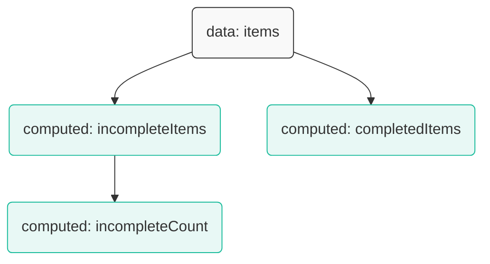

# **重構版：6. 計算屬性 (Computed Properties)**

在我們的 Vue 應用中，經常需要基於現有的響應式資料進行一些運算或轉換，然後再顯示。例如，在我們的待辦事項應用中，我們可能想顯示「還剩下多少未完成的項目」，或者「一個只包含已完成事項的列表」。

雖然可以直接在模板的 `{{ }}` 中寫複雜的表達式，但這會讓模板變得臃腫且難以維護。計算屬性 (Computed Properties) 正是為了解決這個問題而生的優雅方案。

---

## **6.1 為什麼需要計算屬性？一個實際問題**

回顧一下我們在第 4 章遇到的問題：如何只顯示未完成的待辦事項？當時我們使用了 `<template>` 搭配 `v-if` 來解決。

```html
<!-- 之前的方法 -->
<template v-for="item in items" :key="item.id">
    <li v-if="!item.done">
        {{ item.text }}
    </li>
</template>
```
這種方法可行，但如果我們還想在頁面其他地方顯示「已完成」的列表呢？我們就得再寫一個 `v-if="item.done"` 的迴圈。這會導致邏輯重複，且模板越來越複雜。

更理想的方式是，我們希望可以直接這樣寫：
```html
<!-- 理想中的寫法 -->
<h2>待辦事項 ({{ incompleteItems.length }})</h2>
<ul>
    <li v-for="item in incompleteItems" :key="item.id">{{ item.text }}</li>
</ul>

<h2>已完成事項</h2>
<ul>
    <li v-for="item in completedItems" :key="item.id">{{ item.text }}</li>
</ul>
```
這看起來是不是清爽多了？`incompleteItems` 和 `completedItems` 就是我們需要透過**計算屬性**來建立的「衍生資料」。

## **6.2 `computed` 選項：建立衍生資料**

計算屬性是透過 `computed` 選項來定義的。它是一個物件，其中每個屬性都是一個函式，這個函式會回傳一個**新的值**。Vue 會自動追蹤這個函式所依賴的 `data`，只有當依賴的 `data` 改變時，它才會重新計算，否則它會直接回傳快取的結果。

**範例：為待辦事項應用增加計算屬性**
```javascript
const app = Vue.createApp({
    data() {
        return {
            items: [
                { id: 1, text: '學習 Vue 指令', done: true },
                { id: 2, text: '學習計算屬性', done: false },
                { id: 3, text: '去超市購物', done: false }
            ]
        }
    },
    computed: {
        // 計算屬性 1：未完成的項目列表
        incompleteItems() {
            // this.items 發生變化時，這個函式會自動重新執行
            return this.items.filter(item => !item.done);
        },
        // 計算屬性 2：已完成的項目列表
        completedItems() {
            return this.items.filter(item => item.done);
        },
        // 計算屬性 3：未完成項目的數量
        incompleteCount() {
            return this.incompleteItems.length; // 它可以依賴其他的計算屬性！
        }
    }
});
```
現在，我們就可以在模板中像使用普通 `data` 一樣使用這些計算屬性了。



**更新後的模板：**
```html
<div id="app">
    <h2>待辦事項 ({{ incompleteCount }})</h2>
    <ul>
        <li v-for="item in incompleteItems" :key="item.id">
            <input type="checkbox" v-model="item.done">
            <span>{{ item.text }}</span>
        </li>
    </ul>

    <h2 v-if="completedItems.length > 0">已完成</h2>
    <ul>
        <li v-for="item in completedItems" :key="item.id">
            <input type="checkbox" v-model="item.done">
            <span class="done">{{ item.text }}</span>
        </li>
    </ul>
</div>
```
當您勾選任何一個待辦事項時，`items` 陣列會發生變化，Vue 會自動重新計算 `incompleteItems`、`completedItems` 和 `incompleteCount`，並以最高效率更新畫面。這就是計算屬性的威力！

## **6.3 計算屬性 vs. 方法：快取的魔力**

您可能會想，我也可以在 `methods` 中定義一個函式來做同樣的事：
```javascript
methods: {
    getIncompleteItems() {
        console.log('方法被呼叫了！');
        return this.items.filter(item => !item.done);
    }
}
```
然後在模板中這樣用：`v-for="item in getIncompleteItems()"`。

雖然結果看起來一樣，但底層運作有天壤之別：
*   **計算屬性**：**會快取結果**。只有當它的依賴 (`this.items`) 改變時，它才會重新計算。如果 `items` 不變，無論您在模板中存取 `incompleteItems` 多少次，它都只會計算一次，之後直接回傳快取的結果。
*   **方法**：**每次都會執行**。只要模板重新渲染，`getIncompleteItems()` 就會被重新呼叫一次，即使 `items` 沒有任何變化。

**結論：對於任何需要基於現有資料進行計算或轉換的場景，只要您不需要傳遞參數，就應該優先使用計算屬性。這能顯著提升應用程式的效能。**

## **6.4 進階：可寫入的計算屬性 (Getter & Setter)**

預設情況下，計算屬性是「唯讀」的。但有時候，我們可能需要一個「可寫入」的計算屬性。這可以透過同時提供 `get` 和 `set` 函式來實現。

**範例：一個可以雙向綁定的 `fullName`**
```html
<div id="app">
    <p>全名: {{ fullName }}</p>
    <input v-model="fullName"> <!--可以直接修改計算屬性-->
</div>
```
```javascript
const app = Vue.createApp({
    data() {
        return {
            firstName: '張',
            lastName: '三'
        }
    },
    computed: {
        fullName: {
            // getter：當讀取 fullName 時呼叫
            get() {
                return this.firstName + ' ' + this.lastName;
            },
            // setter：當嘗試為 fullName 賦值時呼叫
            set(newValue) {
                const names = newValue.split(' ');
                this.firstName = names[0];
                this.lastName = names[names.length - 1];
            }
        }
    }
});
```
雖然這個功能很強大，但在實際開發中，唯讀的計算屬性佔了 99% 的使用場景。只有在極少數情況下才需要 `setter`。