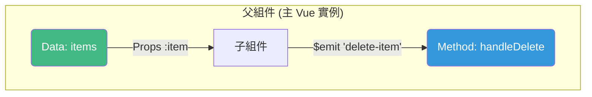

# **Rewritten: 8. 【核心】組件：Vue 最強大的功能**

隨著我們的待辦事項應用功能越來越多，您會發現所有的 HTML 和 JavaScript 邏輯都擠在一個 Vue 實例中，變得難以管理。這時候，我們就需要引入 Vue 最強大、最核心的特性：**組件 (Components)**。

組件允許我們將複雜的 UI 拆分成一個個獨立、可重用的「積木」。每個積木都封裝了自己的 HTML (`template`)、JavaScript (`script`) 和 CSS (`style`)。

---

## **8.1 為何要用組件？重構我們的待辦事項**

看看我們目前的待辦事項列表，`<ul>` 裡面的 `<li>` 元素已經包含了顯示、勾選、樣式綁定等多種邏輯。這是一個完美的重構目標。我們希望將每個待辦事項 `<li>` 抽離成一個獨立的 `<todo-item>` 組件。

**重構前的樣子：**
```html
<ul>
    <li v-for="item in items" :key="item.id">
        <input type="checkbox" v-model="item.done">
        <span :class="{ 'done': item.done }">{{ item.text }}</span>
    </li>
</ul>
```

**我們期望的重構後樣子：**
```html
<ul>
    <todo-item 
        v-for="item in items" 
        :key="item.id">
    </todo-item>
</ul>
```
這個 `<todo-item>` 標籤看起來就像一個普通的 HTML 標籤，但它背後隱藏了自己獨立的模板和邏輯。

## **8.2 `app.component()`：定義你的第一個組件**

在 CDN 環境下，我們主要使用 `app.component()` 來**全域註冊**一個組件。這意味著一旦註冊，它就可以在 Vue 應用的任何地方使用。

```javascript
const app = Vue.createApp({
    // ... 主應用的 data 和 methods
});

// 全域註冊一個名為 'todo-item' 的組件
// 注意：組件名稱在註冊時通常使用 kebab-case (短橫線分隔命名)，
// 因為這與 HTML 標籤的命名習慣一致，且避免與內建 HTML 元素衝突。
app.component('todo-item', {
    // 組件的模板，定義了組件的 HTML 結構
    template: `
        <li>
            <input type="checkbox">
            <span>這是一個待辦事項</span>
        </li>
    `
});

app.mount('#app');
```
現在，`v-for` 會為每個 `item` 渲染一個 `<todo-item>` 組件。但問題來了：所有組件都顯示相同的靜態文字，而且沒有跟我們的 `items` 資料連結起來。

## **8.3 `props`：從父層向子層傳遞資料**

為了讓每個 `<todo-item>` 組件能顯示各自的資料，父層 (主 Vue 實例) 需要將 `item` 物件傳遞給子層 (組件)。這就是 `props` (屬性) 的職責。

**1. 在子組件中聲明 `props`：**
```javascript
app.component('todo-item', {
    // 聲明組件接受一個名為 'item' 的 prop
    props: ['item'],
    template: `
        <li>
            <input type="checkbox" v-model="item.done">
            <span :class="{ 'done': item.done }">{{ item.text }}</span>
        </li>
    `
});
```

**2. 在父層模板中傳遞 `props`：**
```html
<ul>
    <todo-item 
        v-for="item in items" 
        :key="item.id"
        :item="item">  <!-- 使用 v-bind 將 item 物件傳遞給子組件的 'item' prop -->
    </todo-item>
</ul>
```
現在，`v-for` 迴圈中的每個 `item` 物件都會透過 `:item="item"` 這個綁定，被傳遞到對應的 `<todo-item>` 組件中。組件內部就可以透過 `props` 中聲明的 `item` 來存取這些資料了。

### **命名慣例：組件標籤與 Prop (重要！)**

在 Vue 中，組件的命名和 Prop 的命名遵循一套重要的慣例，這有助於保持程式碼的一致性和可讀性，並避免與 HTML 的特性產生衝突。

#### **1. 組件標籤的命名**

當您使用 `app.component()` 註冊組件時，建議使用**短橫線分隔命名 (kebab-case)**，例如 `todo-item`。

*   **HTML 模板中使用**：`<todo-item>`
*   **JavaScript 註冊時**：`app.component('todo-item', ...)`

**為什麼？**
*   **符合 HTML 規範**：HTML 標籤本身就是不區分大小寫的，並且習慣使用短橫線分隔。使用 `kebab-case` 可以避免與未來可能出現的 HTML 元素名稱衝突。
*   **提高可讀性**：在模板中，`kebab-case` 的組件標籤看起來更像標準的 HTML 元素，提高了模板的可讀性。

#### **2. Prop 的命名**

Prop 的命名則是在 JavaScript 和 HTML 模板之間存在一個自動轉換的規則。

*   **JavaScript 中聲明 Prop**：在組件的 `props` 選項中，建議使用**駝峰式命名 (camelCase)**，例如 `initialCount`、`todoItem`。這是 JavaScript 變數的標準命名慣例。

    ```javascript
    props: ['initialCount', 'todoItem']
    // 或者更詳細的驗證
    props: {
        initialCount: Number,
        todoItem: Object
    }
    ```

*   **HTML 模板中傳遞 Prop**：當您在父組件的模板中向子組件傳遞 Prop 時，必須使用**短橫線分隔命名 (kebab-case)**，例如 `:initial-count="myCount"`、`:todo-item="itemData"`。

    ```html
    <my-component :initial-count="count" :todo-item="currentTodo"></my-component>
    ```

**為什麼？**
*   **HTML 不區分大小寫**：HTML 屬性名是不區分大小寫的。如果我們在 HTML 中使用 `camelCase` (例如 `<my-component initialCount="1">`)，瀏覽器會將其解析為小寫 (`initialcount="1"`)，導致 Vue 無法正確匹配到 JavaScript 中聲明的 `initialCount` Prop。
*   **Vue 自動轉換**：Vue 會自動將 HTML 模板中 `kebab-case` 的 Prop 名稱轉換為 JavaScript 中對應的 `camelCase` Prop 名稱。

#### **3. Prop 驗證**

為了讓組件更健壯，您可以為 `props` 定義更詳細的驗證規則，例如類型、是否必填、預設值等。這有助於在開發階段捕獲錯誤。

```javascript
props: {
    item: {
        type: Object,      // 期望是物件
        required: true,    // 必填
        default: () => ({}) // 提供預設值，特別是物件或陣列時，必須是函式回傳
    },
    title: {
        type: String,
        default: '預設標題'
    },
    initialCount: {
        type: Number,
        validator: function (value) {
            // 值必須是數字且大於等於 0
            return value >= 0
        }
    }
}
```
當 Prop 驗證失敗時，Vue 會在瀏覽器主控台發出警告，這對於偵錯非常有幫助。

## **8.4 `$emit`：從子層向父層發送事件**

我們的 `<todo-item>` 現在可以顯示資料了，但如果想在組件內部刪除這個項目呢？`items` 陣列存在於父層，子組件不應該也無法直接修改父層的資料（這是 Vue 的**單向資料流**原則）。

正確的做法是：子組件向父層**發送一個事件**，通知父層「請刪除我」。這就是 `$emit` 的職責。

**1. 在子組件中添加按鈕並 `$emit` 事件：**
```javascript
app.component('todo-item', {
    props: ['item'],
    // 聲明組件會發出的事件，有助於文件和可讀性
    emits: ['delete-item'], 
    template: `
        <li>
            <input type="checkbox" v-model="item.done">
            <span :class="{ 'done': item.done }">{{ item.text }}</span>
            <button @click="$emit('delete-item', item.id)">刪除</button>
        </li>
    `
});
```
當「刪除」按鈕被點擊時，`$emit('delete-item', item.id)` 會觸發一個名為 `delete-item` 的自訂事件，並將 `item.id` 作為參數傳遞出去。

**2. 在父層監聽事件：**
```html
<ul>
    <todo-item 
        v-for="item in items" 
        :key="item.id"
        :item="item"
        @delete-item="handleDelete"> <!-- 監聽子組件發出的 'delete-item' 事件 -->
    </todo-item>
</ul>
```
```javascript
// 在主 Vue 實例的 methods 中
methods: {
    handleDelete(idToDelete) {
        // 根據子組件傳來的 id，過濾掉要刪除的項目
        this.items = this.items.filter(item => item.id !== idToDelete);
    }
}
```
父層透過 `@delete-item="handleDelete"` 監聽到了事件，並呼叫 `handleDelete` 方法。子層透過 `$emit` 傳遞的 `id` 會作為參數傳入 `handleDelete` 方法，從而實現了刪除操作。

這種 **"Props down, Events up"** (屬性向下傳遞，事件向上传遞) 的模式是 Vue 組件間溝通的黃金準則。



## **8.5 程式碼組織與最佳實踐**

### **組件的 `data` 必須是函式**
這是一個非常重要的規則。如果組件有自己的 `data`，它必須是一個回傳新物件的函式，以確保每個組件實例都有獨立的資料，互不影響。
```javascript
app.component('my-component', {
    data() {
        return {
            // 每個實例都有自己的 count
            count: 0 
        }
    },
    // ...
});
```

### **將組件分離到外部 `.js` 檔案 (推薦)**
當組件變多時，將它們放在獨立的 `.js` 檔案中是更好的做法。

**1. 創建 `wwwroot/js/components.js`：**
```javascript
// 在這個檔案中定義所有組件
// 注意：這個檔案需要在 Vue 應用實例掛載 (mount) 之前被載入

// 組件 A
const TodoItem = {
    props: ['item'],
    emits: ['delete-item'],
    template: `...` 
};

// 組件 B
const TodoForm = {
    /* ... */
};
```

**2. 在 `.cshtml` 中註冊和使用：**
```csharphtml
@section Scripts {
    <!-- 1. 引入 Vue 核心庫 -->
    <script src="https://unpkg.com/vue@3/dist/vue.global.js"></script>
    <!-- 2. 引入組件定義檔案 -->
    <script src="~/js/components.js"></script>

    <!-- 3. 創建 Vue 應用 -->
    <script>
        const app = Vue.createApp({
            data() { /* ... */ },
            methods: { /* ... */ }
        });

        // 4. 註冊從外部檔案載入的組件
        app.component('todo-item', TodoItem);
        app.component('todo-form', TodoForm);

        // 5. 掛載應用
        app.mount('#app');
    </script>
}
```
這種方式讓您的 `.cshtml` 檔案保持簡潔，同時讓 JavaScript 程式碼更具模組化和可維護性。