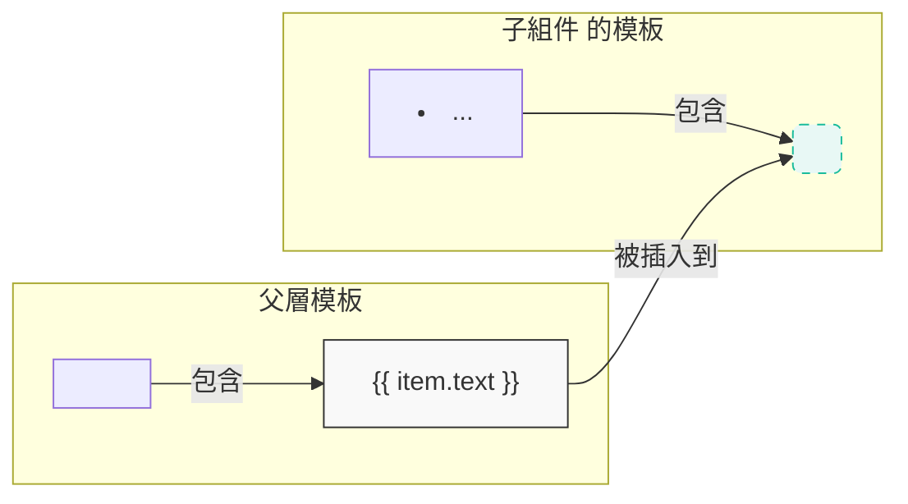

# **Rewritten: 9. 組件的插槽 (Slots)：客製化的力量**

在上一章，我們成功地將待辦事項 `<li>` 封裝成了 `<todo-item>` 組件。這非常棒，但它也帶來了一個新問題：這個組件的內部結構被「寫死」了。如果我們想在某些項目後面加上一個「緊急」標籤，或者為另一些項目加上一個編輯圖示，該怎麼辦？難道要為每種變化都創建一個新組件嗎？

當然不用。**插槽 (Slots)** 就是為了解決這個問題而生的。它允許父層向子組件的模板中「插入」任意的 HTML 內容，讓組件變得極其靈活和可客製化。

---

## **9.1 預設插槽 (Default Slot)：讓組件接受內容**

預設插槽是最簡單的插槽。它允許父組件在子組件的標籤內部提供任意內容，這些內容將會被渲染到子組件模板中 `<slot></slot>` 標籤所在的位置。

**範例：改造我們的 `<todo-item>` 組件**

**1. 在子組件 (`todo-item`) 的模板中，用 `<slot>` 預留一個位置：**
```javascript
// 在 todo-item 組件的定義中
template: `
    <li>
        <input type="checkbox" v-model="item.done">
        <slot></slot> <!-- 內容將會被插入到這裡 -->
    </li>
`
```

**2. 在父層，像使用普通 HTML 標籤一樣，在組件標籤內提供內容：**
```html
<ul>
    <todo-item v-for="item in items" :key="item.id" :item="item">
        <!-- 這裡的內容會被傳遞給子組件的 <slot> -->
        <span :class="{ 'done': item.done }">{{ item.text }}</span>
    </todo-item>
</ul>
```
現在，父層的 `<span>` 會被精準地插入到子組件的 `<slot>` 位置。這看起來和我們之前的版本結果一樣，但現在我們獲得了客製化的能力！



例如，我們可以輕鬆地為某個項目加上額外標籤：
```html
<todo-item :item="someUrgentItem">
    <span :class="{ 'done': someUrgentItem.done }">{{ someUrgentItem.text }}</span>
    <strong style="color: red;"> (緊急!)</strong> <!-- 輕鬆加入額外內容 -->
</todo-item>
```

### **插槽的後備內容 (Fallback Content)**
您可以為插槽提供「後備內容」。如果父層沒有提供任何內容，後備內容就會被渲染。
```javascript
template: `
    <li>
        <input type="checkbox" v-model="item.done">
        <slot>
            <!-- 如果父層沒有提供內容，這段文字會顯示 -->
            <p>沒有提供待辦事項內容。</p>
        </slot>
    </li>
`
```

## **9.2 作用域插槽 (Scoped Slots)：讓子組件傳遞資料給插槽**

上面的範例有一個問題：我們在父層的插槽內容中，仍然需要存取 `item` 物件 (例如 `item.done` 和 `item.text`)。但 `item` 是在 `v-for` 中定義的，如果插槽的邏輯變得複雜，我們可能希望將 `item` 的存取權限「交還」給插槽本身。

**作用域插槽**允許子組件向父層的插槽內容**傳遞資料**。

**1. 在子組件的 `<slot>` 標籤上，綁定您想傳遞出去的資料：**
```javascript
// 在 todo-item 組件的定義中
template: `
    <li>
        <!-- 將 item 物件本身作為一個 prop 傳遞給插槽 -->
        <slot :item="item"></slot>
    </li>
`
```

**2. 在父層，使用 `v-slot` 指令來接收子組件傳遞的資料：**
```html
<ul>
    <todo-item v-for="item in items" :key="item.id">
        <!-- v-slot="slotProps" 會接收一個包含所有傳遞資料的物件 -->
        <template v-slot="slotProps">
            <input type="checkbox" v-model="slotProps.item.done">
            <span :class="{ 'done': slotProps.item.done }">
                {{ slotProps.item.text }}
            </span>
        </template>
    </todo-item>
</ul>
```
**解釋：**
*   子組件的 `<slot :item="item">` 將 `item` 物件打包傳出。
*   父層的 `<template v-slot="slotProps">` 接收到這個包，並將其命名為 `slotProps`。此時 `slotProps` 就是 `{ item: { id: 1, ... } }`。
*   然後我們就可以在 `<template>` 內部透過 `slotProps.item` 來存取子組件的資料。

`v-slot` 也可以使用解構賦值和簡寫 `#` 來讓程式碼更簡潔：
```html
<!-- 使用解構賦值和 # 簡寫 -->
<todo-item v-for="item in items" :key="item.id">
    <template #default="{ item }"> <!-- 直接解構出 item -->
        <input type="checkbox" v-model="item.done">
        <span :class="{ 'done': item.done }">{{ item.text }}</span>
    </template>
</todo-item>
```
作用域插槽是實現高度可重用組件的關鍵，它將「資料的來源（子組件）」和「如何渲染（父組件）」完美地分開。

## **9.3 具名插槽 (Named Slots)**

當一個組件需要多個可客製化的內容區域時，預設插槽就不夠用了。這時我們可以使用「具名插槽」。

**範例：一個更複雜的 `<page-layout>` 組件**
```html
<!-- 父層使用 -->
<page-layout>
    <!-- 使用 #header 簡寫來指定插槽 -->
    <template #header>
        <h1>我的待辦事項應用</h1>
    </template>

    <!-- 沒有名字的內容會進入預設插槽 -->
    <ul>
        <!-- ... 我們的 todo-item 列表 ... -->
    </ul>

    <template #footer>
        <p>&copy; 2024 版權所有</p>
    </template>
</page-layout>
```

```javascript
// page-layout 組件的定義
app.component('page-layout', {
    template: `
        <div class="container">
            <header>
                <slot name="header"></slot>
            </header>
            <main>
                <slot></slot> <!-- 預設插槽 -->
            </main>
            <footer>
                <slot name="footer"></slot>
            </footer>
        </div>
    `
});
```
透過具名插槽，我們可以建立出高度靈活的佈局組件，讓父層可以完全控制頁面的各個部分，同時又能重用佈局組件的通用結構和樣式。