# **重構版：11. 模板引用 ($refs) 與 DOM 操作 ($nextTick)**

Vue 的核心思想是資料驅動視圖，我們應該盡量避免直接操作 DOM。然而，在某些特定情況下，我們仍然需要直接存取底層的 DOM 元素或子組件實例。例如，在項目進入編輯模式後自動聚焦到輸入框，或手動觸發一個子組件的動畫。此時，`$refs` 和 `$nextTick` 就成為了我們不可或缺的「逃生艙口」。

---

## **11.1 `$refs`：存取 DOM 元素與組件實例**

`$refs` 是一個物件，它包含了所有在模板中註冊了 `ref` 屬性的 DOM 元素或子組件實例。您可以把它想像成是給某個特定元素或組件掛上一個「名牌」，以便稍後能透過名字直接找到它。

### **範例 1：存取 DOM 元素 (自動聚焦)**

讓我們為待辦事項應用增加一個「雙擊編輯」功能。當進入編輯模式時，我們需要**自動聚焦**到那個新出現的 `<input>` 元素上。

**1. 在模板中的目標元素上添加 `ref` 屬性：**
```html
<!-- 在 todo-item 組件的模板中 -->
<input 
    v-if="isEditing"
    ref="editInput"  <!-- 給 input 元素掛上名牌 'editInput' -->
    type="text" 
    ...>
```

**2. 在 `methods` 中透過 `this.$refs` 存取該元素：**
```javascript
// 在 todo-item 組件的 methods 中
methods: {
    startEditing() {
        this.isEditing = true;
        // 注意：這裡直接呼叫會失敗，我們將在 11.3 節解決這個問題
        // this.$refs.editInput.focus(); 
    }
}
```

### **範例 2：存取子組件實例**

`$refs` 不僅能引用 DOM 元素，也能引用子組件實例，讓父組件可以呼叫子組件的 `methods`。

**假設我們有一個通知組件 `<alert-box>`：**
```javascript
app.component('alert-box', {
    data() {
        return { message: '', visible: false };
    },
    methods: {
        show(msg) {
            this.message = msg;
            this.visible = true;
            setTimeout(() => { this.visible = false; }, 2000);
        }
    },
    template: `<div v-if="visible" class="alert">{{ message }}</div>`
});
```

**父層可以這樣呼叫它：**
```html
<div id="app">
    <!-- 在子組件上掛上 ref -->
    <alert-box ref="alerter"></alert-box>
    <button @click="showAlert">顯示通知</button>
</div>
```
```javascript
// 在主 Vue 實例的 methods 中
methods: {
    showAlert() {
        // 透過 this.$refs.alerter 存取子組件實例，並呼叫其 show 方法
        this.$refs.alerter.show('這是一條來自父層的訊息！');
    }
}
```

**注意事項：**
*   `$refs` 只有在組件**掛載完成後** (`mounted`) 才能被存取。
*   `$refs` **不是響應式**的。您不應該在模板或計算屬性中依賴 `$refs` 的變化。它僅用於命令式的程式碼操作。

## **11.2 警告：何時應該避免使用 `$refs`**

儘管 `$refs` 提供了直接存取的能力，但它應該被視為一種**最後的手段**。濫用 `$refs` 會破壞 Vue 資料驅動的原則，讓程式碼變得難以理解和維護。

**避免使用 `$refs` 的情況：**
*   **任何可以透過資料綁定實現的**：例如，用 `v-if` 切換顯示/隱藏，用 `:class` 改變樣式，用 `{{ }}` 改變文本。
*   **任何可以透過 `props` 和 `$emit` 實現的組件間通訊**：父子組件之間的互動應該優先使用標準的資料流模式。

**合理使用 `$refs` 的場景：**
*   **管理焦點、文本選擇或媒體播放**：例如，`element.focus()`、`video.play()`。
*   **整合第三方 DOM 函式庫**：當需要將一個原生 DOM 元素傳遞給 jQuery 插件或圖表庫時。
*   **觸發命令式動畫**：當動畫庫需要直接操作 DOM 元素時。
*   **獲取元素尺寸或位置**：當需要讀取元素的 `offsetWidth` 或 `getBoundingClientRect()` 等屬性時。

## **11.3 `$nextTick`：等待下一次 DOM 更新**

現在，我們回頭解決 11.1 節中留下的問題：為什麼 `this.$refs.editInput.focus()` 會失敗？

**原因**：Vue 為了提高效能，會將多個資料變更操作進行**批次處理 (batching)**。當您修改了響應式資料 (如 `this.isEditing = true`) 時，DOM **不會立即更新**，而是會在下一個「tick」(即下一個事件循環週期) 中進行非同步更新。

這意味著在 `this.isEditing = true;` 的下一行程式碼執行時，`v-if` 的 `<input>` 元素**還沒有被渲染到真實的 DOM 中**，所以 `this.$refs.editInput` 是 `undefined`。

`this.$nextTick(callback)` 就是為了解決這個問題而存在的。它會將您的回呼函式**延遲**到 Vue 完成當前這一輪 DOM 更新之後才執行。

```mermaid
sequenceDiagram
    participant User
    participant Component
    participant VueQueue as Vue 更新佇列
    participant DOM

    User->>Component: 雙擊觸發 startEditing()
    Component->>Component: this.isEditing = true
    Component->>VueQueue: 將「渲染 <input>」任務入列
    Component->>VueQueue: 將 "$nextTick 回呼" 任務入列
    Note right of VueQueue: --- 事件循環 Tick ---
    VueQueue->>DOM: 執行 DOM 更新, 渲染 <input>
    VueQueue->>Component: 執行 $nextTick 回呼函式
    Component->>DOM: 呼叫 input.focus()
```



**正確的做法：**
```javascript
// 在 todo-item 組件的 methods 中
methods: {
    startEditing() {
        this.isEditing = true;
        // 將聚焦操作放入 $nextTick 的回呼函式中
        this.$nextTick(() => {
            // 現在，<input> 元素已經存在於 DOM 中了
            this.$refs.editInput.focus();
        });
    },
    finishEditing(event) {
        // ... 更新 item.text 的邏輯 ...
        this.isEditing = false;
    }
}
```
**流程拆解：**
1.  `startEditing` 被呼叫，`isEditing` 變為 `true`。
2.  Vue 偵測到變化，將「顯示 `<input>`」的 DOM 更新任務放入一個內部佇列。
3.  `$nextTick` 將 `() => { this.$refs.editInput.focus(); }` 這個回呼函式也放入佇列，排在 DOM 更新任務**之後**。
4.  當前的同步程式碼執行完畢，Vue 開始處理佇列。
5.  Vue 執行 DOM 更新任務，`<input>` 被渲染到畫面上。
6.  Vue 執行 `$nextTick` 的回呼函式，此時 `this.$refs.editInput` 已經可以被安全地存取，`focus()` 成功執行。

總之，當您**修改了資料**，並希望在**同一個函式中**，立即對**因該資料變化而更新的 DOM** 進行操作時，就必須使用 `$nextTick`。