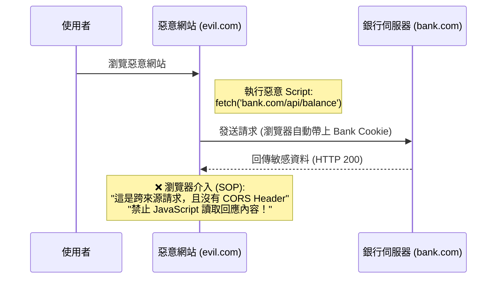
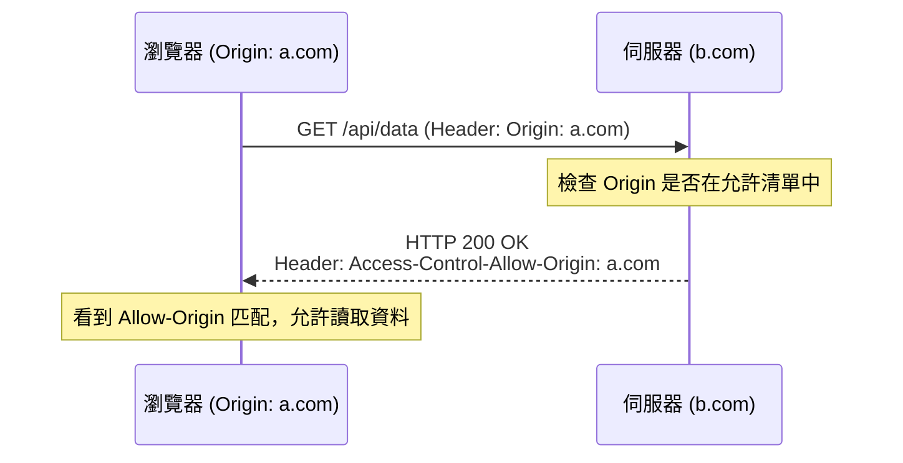
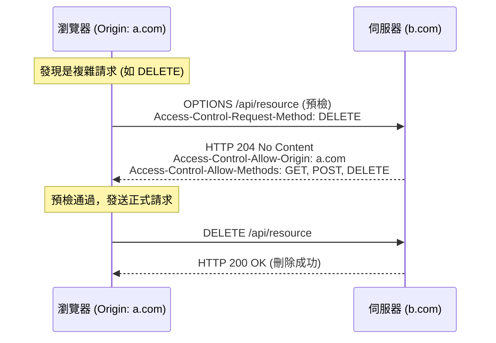

# CORS (Cross-Origin Resource Sharing) 跨來源資源共用

CORS 是一個安全性機制，讓瀏覽器能夠安全地在不同的來源（Origin）之間進行資源交換。

## 1. 為什麼需要 CORS？
瀏覽器基於 **同源政策 (Same-Origin Policy, SOP)**，預設會限制腳本（如 JavaScript）存取不同來源的資源。

**所謂「同源」指的是：**
1. **通訊協定 (Protocol)** 相同 (如 http, https)
2. **網域 (Domain)** 相同 (如 example.com)
3. **連接埠 (Port)** 相同 (如 80, 443)

如果以上任一項不同，就是「跨來源」。

### 1.1 資安情境：如果沒有同源政策會怎樣？
若沒有同源政策，惡意網站就可以利用使用者的瀏覽器，偷取使用者在其他網站的敏感資料。

**攻擊案例：偷取銀行餘額**
1. 使用者登入了 `bank.com`，瀏覽器存有 Session Cookie。
2. 使用者不小心逛到了惡意網站 `evil.com`。
3. `evil.com` 的 JavaScript 背後偷偷發送請求給 `bank.com/api/balance`。
4. 如果沒有 SOP，瀏覽器會自動帶上 `bank.com` 的 Cookie。
5. `bank.com` 回傳餘額資料。
6. `evil.com` 的腳本讀取到餘額，並傳送給駭客。

**同源政策的防護：**
在步驟 6，瀏覽器會攔截回應，**禁止 `evil.com` 讀取 `bank.com` 的資料**，因為它們來源不同。

> **注意**：SOP 主要是防止「讀取」回應，並不能完全防止「發送」請求（這部分通常由 CSRF Token 防護）。CORS 則是讓伺服器有權限「放行」特定的跨來源讀取。

---

## 2. CORS 的運作原理

CORS 主要透過 HTTP Header 來運作。當瀏覽器發現請求跨來源時，會自動在 Request Header 加入 `Origin` 欄位。

### A. 簡單請求 (Simple Request)
滿足特定條件（如 GET/POST、特定 Content-Type）時，瀏覽器會直接發出請求。

### B. 預檢請求 (Preflight Request)
當請求可能對伺服器資料造成影響（如 PUT、DELETE 或自定義 Header）時，瀏覽器會先發送一個 `OPTIONS` 請求進行確認。

---

## 3. 常見的 CORS 相關 Header

### Request Headers (瀏覽器發出)
- `Origin`: 發出請求的來源網域。
- `Access-Control-Request-Method`: 預檢請求時，告訴伺服器正式請求會用什麼方法。
- `Access-Control-Request-Headers`: 預檢請求時，告訴伺服器正式請求會帶哪些自定義 Header。

### Response Headers (伺服器回傳)
- `Access-Control-Allow-Origin`: 允許存取的來源。可以使用 `*` 代表允許所有網域（但不安全）。
- `Access-Control-Allow-Methods`: 允許的 HTTP 方法。
- `Access-Control-Allow-Headers`: 允許的 Header。
- `Access-Control-Allow-Credentials`: 是否允許攜帶 Cookie 或認證資訊。

---

## 4. 如何解決 CORS 問題？

1.  **後端設定 (推薦)**：在伺服器端（如 Node.js, ASP.NET Core, Java）配置 CORS 中間件，設定 `Access-Control-Allow-Origin`。
2.  **Proxy 代理**：在開發環境（如 Vite, Webpack）設定開發伺服器轉發請求，讓瀏覽器以為是同源。
3.  **JSONP (過時)**：利用 `<script>` 標籤不受 SOP 限制的特性，但僅限 GET 請求且不安全。

## 5. 總結
CORS 不是一個錯誤，而是一個**安全性防護**。當你在主控台看到 CORS 錯誤時，代表瀏覽器為了保護使用者，擋下了未經伺服器許可的跨來源存取。解決方案通常是在**伺服器端**明確授權。
